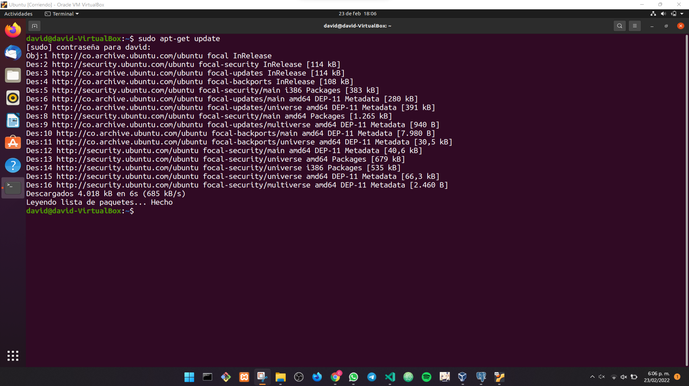
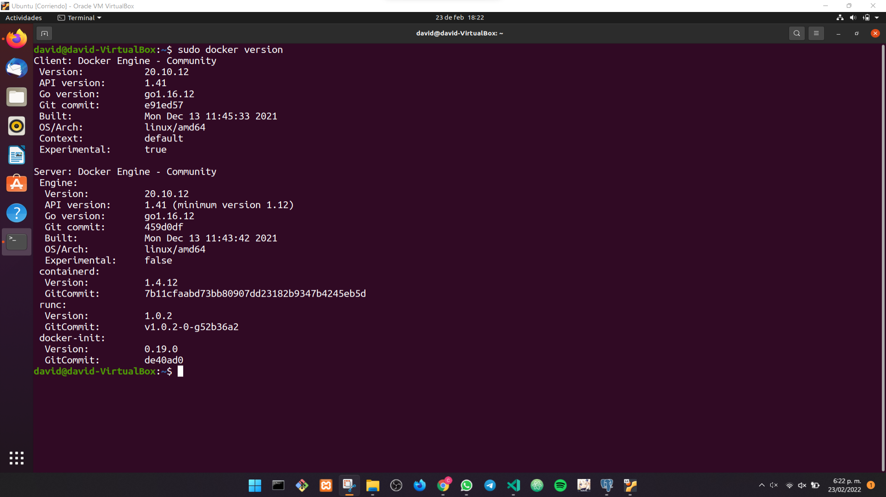
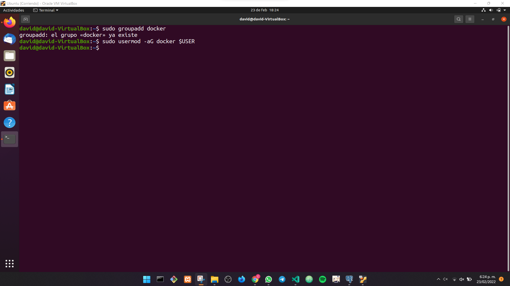

# Instalación de Docker

## Actualización de paquetes

```txt
~$ sudo apt-get update
```



## Instalar paquetes necesarios para Docker

```txt
~$ sudo apt-get install ca-certificates curl gnupg lsb-release 
```


```txt
~$ curl -fsSL https://download.docker.com/linux/ubuntu/gpg  | sudo gpg --dearmor -o /usr/share/keyrings/docker-archive-keyring.gpg
```

```txt
echo "deb [arch=$(dpkg --print-architecture) signed-by=/usr/share/keyrings/docker-archive-keyring.gpg] https://download.docker.com/linux/ubuntu $(lsb_release -cs) stable" | sudo tee /etc/apt/sources.list.d/docker.list > /dev/null
```

```txt
~$ sudo apt-get update
```


```txt
~$ sudo  apt-get  install  docker-ce  docker-ce-cli  containerd.io
```


## Versión de Docker

```txt
~$ sudo docker version
```



## Añadir un groupadd para Docker y activar el modo de usuario

```txt
~$ sudo groupadd docker 
```

```txt
~$ sudo usermod -aG docker $USER
```



## Descargar Imagen Hello World


```txt
~$ sudo docker pull hello-world
```


## Listar las imágenes contenidas en Docker

```txt
~$ sudo docker images
```


## Correr la imagen Hello World

```txt
~$ sudo docker run hello-world
```


## Buscar imágenes de Ubuntu para Docker

```txt
~$ sudo docker search ubuntu
```


## Descargar imagen de Ubuntu

```txt
~$ sudo docker pull ubuntu
```

```txt
~$ sudo docker images
```


## Correr un contenedor de Ubuntu

```txt
~$ sudo docker run ubuntu echo 'Hello world'
```

```txt
~$ sudo docker run -it ubuntu bash
```


## Listar contenedores activos

```txt
~$ sudo docker ps
```

Mientras un contenedor está activo


Cuando no hay contenedores activos


