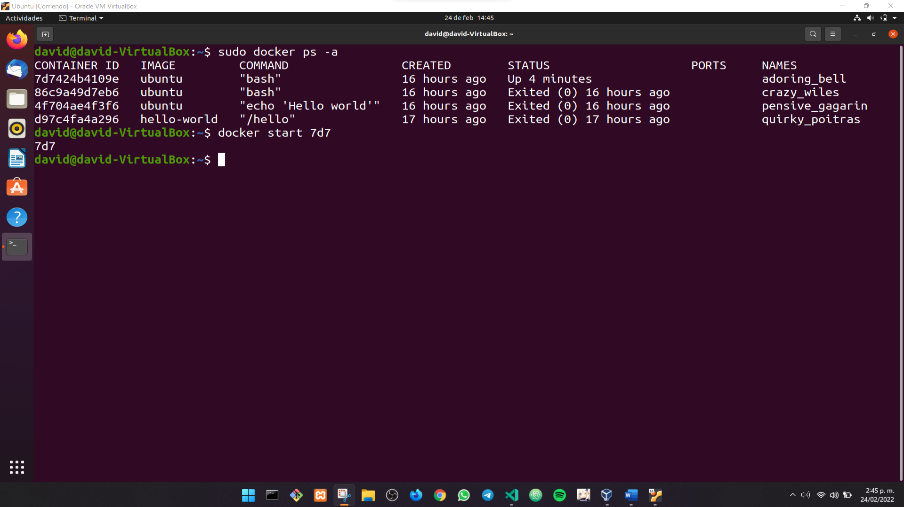
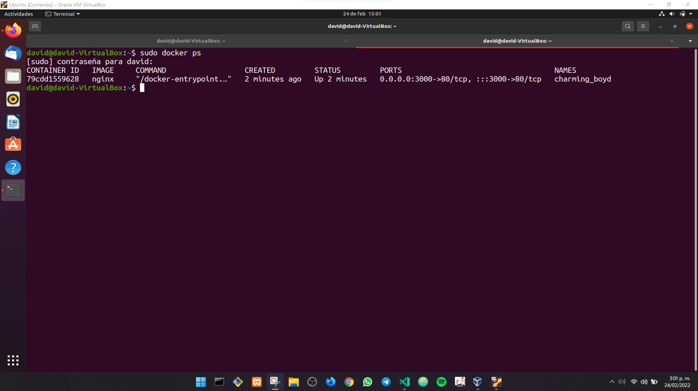
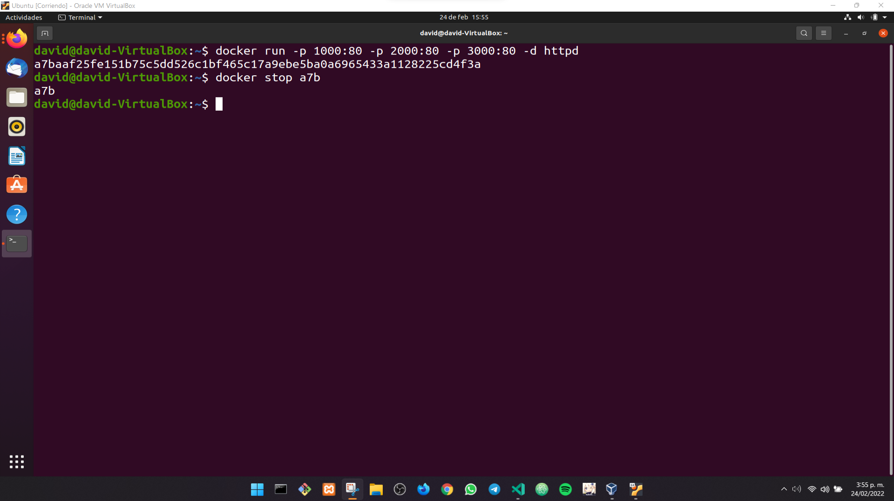

# Repaso Comandos Docker

> Guía elaborada por: ***Carlos David Páez Ferreira***
>
> Guía Liderada por: ***Harvey Nicolás Echavarria Ortiz***
>
> Fecha: ***24 Febrero 2022***

## Listar las imágenes

```txt
~$ sudo docker images
```


## Observar todos los contenedores

```txt
~$ sudo docker ps -a
```


## Poner a correr un contenedor

### ... Por el nombre

```txt
~$ sudo docker start <name>
```


### ... Por el id

```txt
~$ sudo docker start <id>
```


### ... Por las 3 iniciales del id

```txt
~$ sudo docker start <3 iniciales del id>
```



## Observar los contenedores corriendo

```txt
~$ sudo docker ps
```


## Detener un contenedor

```txt
~$ sudo docker stop <name, id, o 3 iniciales del id>
```


## NGINX

### Instalar la imagen de Nginx

```txt
~$ sudo docker pull nginx
```


```txt
~$ sudo docker images
```


### Correr un contenedor de Nginx con n puerto

```txt
~$ sudo docker run -p <puerto de lanzamiento al navegador>:<puerto por donde se escucha> nginx
```


En una nueva pestaña observamos los contenedores activos.

```txt
~$ sudo docker ps
```



### Correr un contenedor Nginx en segundo plano

Para no usar otra pestaña de la terminal, usamos la bandera `-d`

```txt
~$ sudo docker run -p <puerto de lanzamiento al navegador>:<puerto por donde se escucha> -d nginx
```


Podemos observar que el contenedor está corriendo, cuando dentro del navegador ingresamos la dirección `localhost:3000` o el puerto con el que se configuro el contenedor con la imagen:


### Detener el contenedor de Nginx

```txt
~$ sudo docker stop <name, id, o 3 iniciales del id>
```


Si volvemos al navegador, podemos observar que ya no está disponible el contenedor:


### Ejecutar el contenedor en diversos puertos a la vez

Podemos ejecutar varios contenedores de la misma imagen, a la vez, pero en diversos puertos:

```txt
~$ sudo docker run -p 1000:80 -d nginx
```

```txt
~$ sudo docker run -p 2000:80 -d nginx
```

```txt
~$ sudo docker run -p 3000:80 -d nginx
```


### Listar los contenedores por ID

```txt
~$ sudo docker ps -aq
```


### Remover los contenedores por el ID

```txt
~$ sudo docker rm <id, o 3 iniciales del id>
```


### Remover todos los contenedores

Podemos pasar un arreglo con los id de todos los contenedores, y con ello lo podemos remover a la vez.

```txt
~$ sudo docker rm $(docker ps -aq)
```


### Comando para correr varios contenedores de la misma imagen pero en varios puertos

```txt
~$ sudo docker run -p 1000:80 -p 2000:80 -p 5000:80 nginx
```


### Detener los contenedores

```txt
~$ sudo docker stop <3 iniciales del id>
```


## HTTPD

### Instalar la imagen de HTTPD

```txt
~$ sudo docker pull httpd
```


### Verificar si se encuentra la imagen

```txt
~$ sudo docker images
```


### Correr en varios puertos

```txt
~$ sudo docker run -p 1000:80 -p 2000:80 -p 5000:80 httpd
```


### Detener los contenedores de httpd

```txt
~$ sudo docker stop a7b
```




