# Más comandos de Docker

> Guía diseñada por: ***Carlos David Páez Ferreira***
> Guía liderada por: ***Harvey Nicolás Echavarria Ortiz***
> Fecha: 01 Marzo 2022

## Correr contenedores en segundo plano de HTTPD

```txt
~$ docker run -p 1000:80 -p 2000:80 -p 3000:00 -d httpd
```

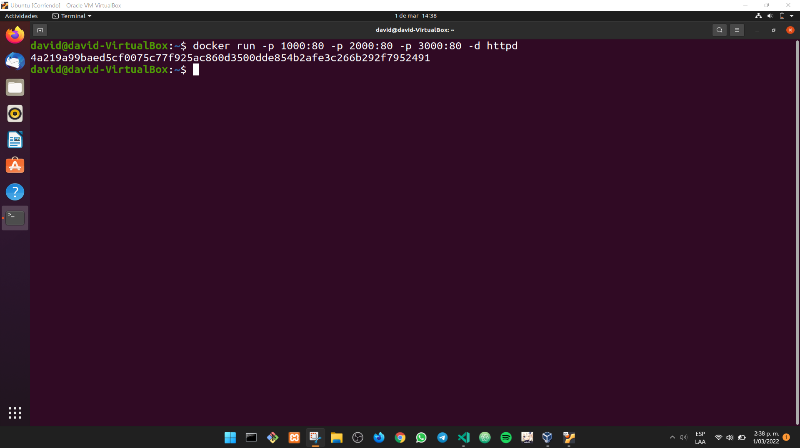

## Listar los contenedores activos

```txt
~$ docker ps
```

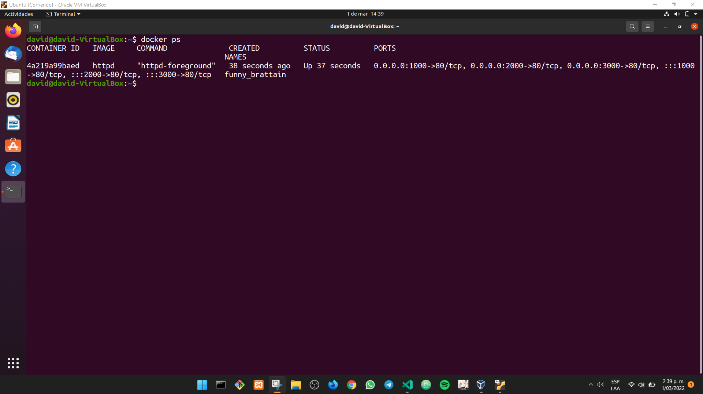

## Descargar la imagen de MySQL

```txt
~$ docker pull mysql
```

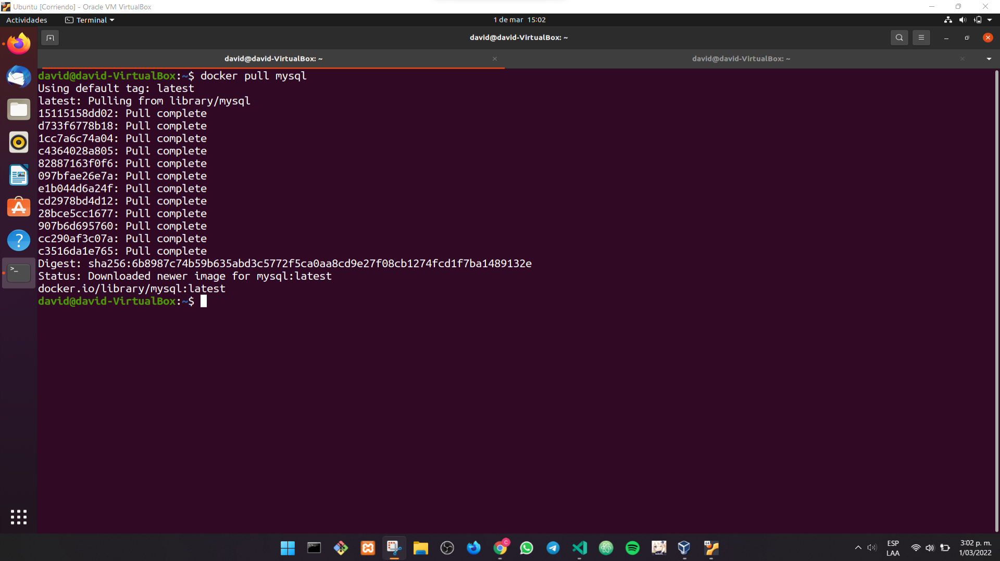

## Correr un contenedor con MySQL con un nombre especifico

```txt
~$ docker run -d -p 3306:3306 --name mydatabase mysql
```

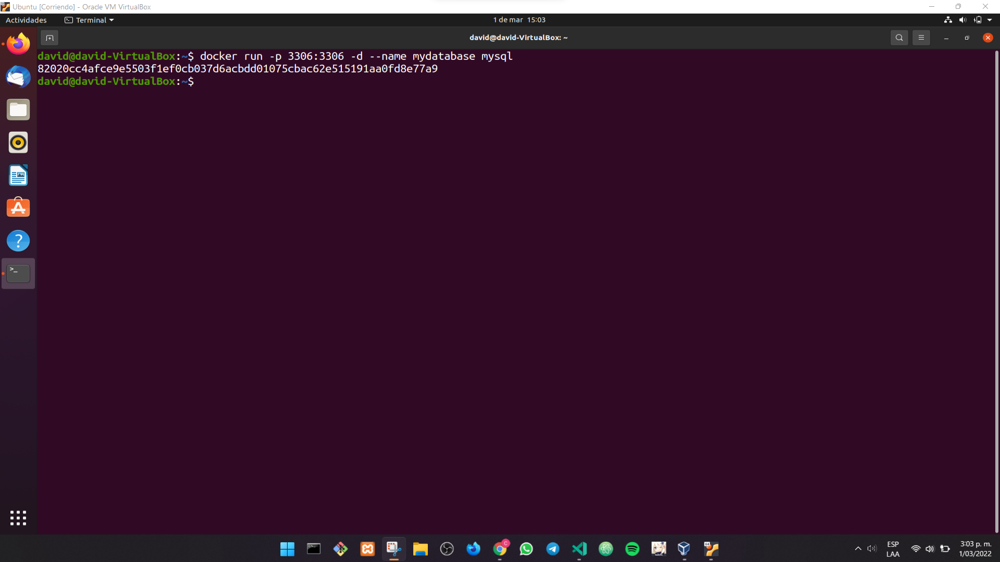

```txt
~$ docker ps -a
```

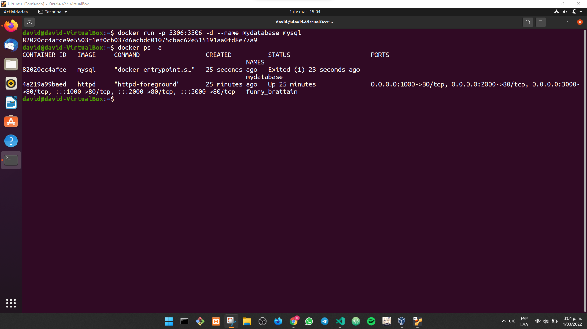

## Eliminar todos los contenedores

```txt
~$ docker rm $(docker ps -aq)
```

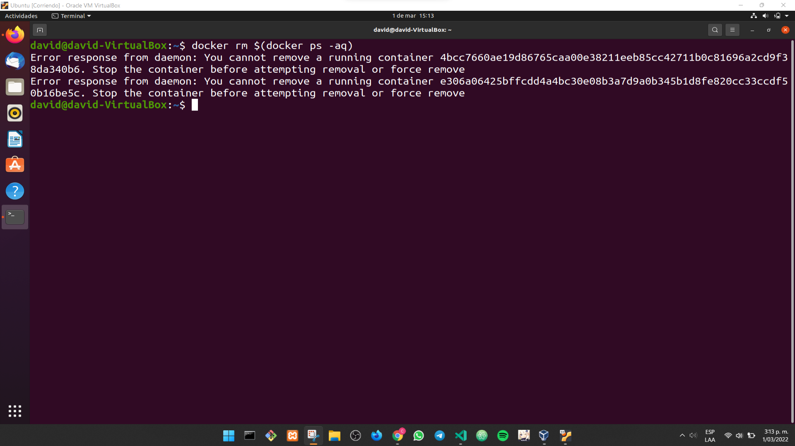

## Forzar la detención de un contenedor

```txt
~$ docker rm $(docker ps -aq) -f
```

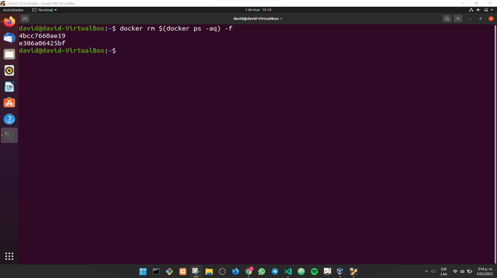

```txt
~$ docker ps -a
```


## Añadir variables de entorno

```txt
~$ docker run -d -p 3307:3307 --name mydatabase -e MYSQL_ROOT_PASSWORD=password mysql
```


```txt
~$ docker ps -aq
```

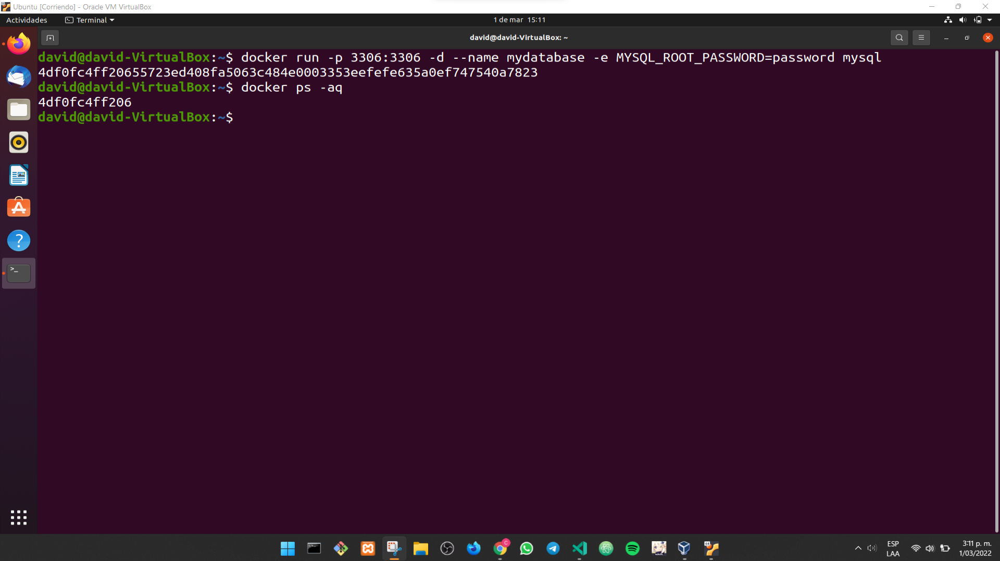

```txt
~$ docker ps -a
```

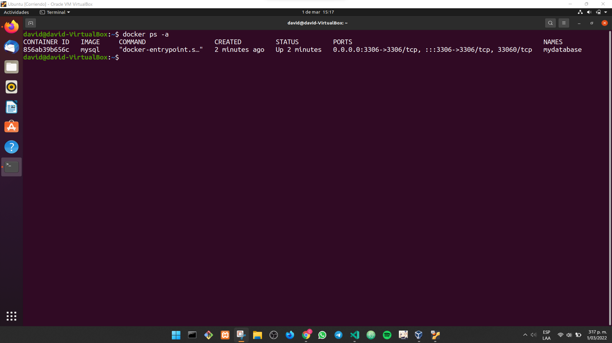

## Levantar un servidor de NGINX

```txt
~$ docker run -p 1000:80 -d --name server-nginx nginx
```

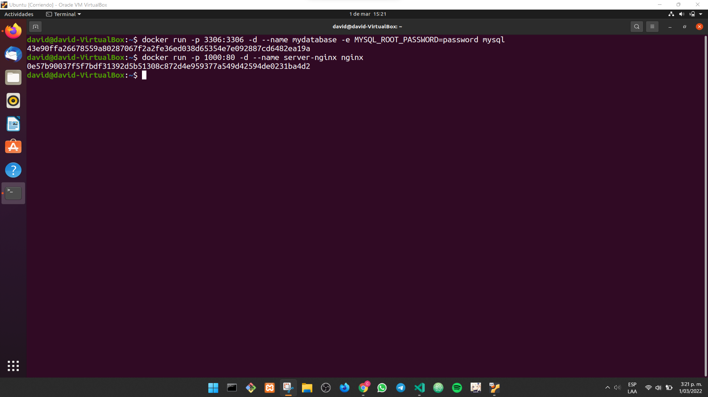

```txt
~$ docker ps -a
```

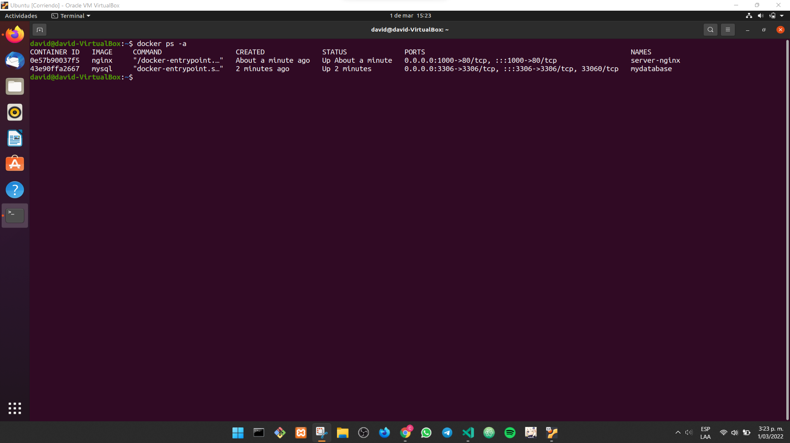

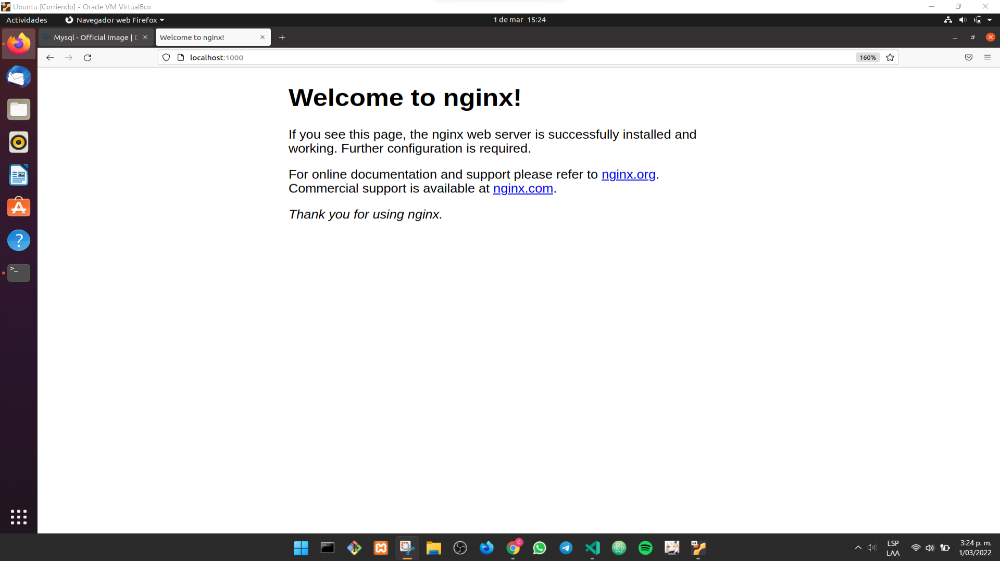

## Remover el contenedor de NGINX por el nombre

```txt
~$ docker stop server-nginx
```

```txt
~$ docker rm server-nginx
```

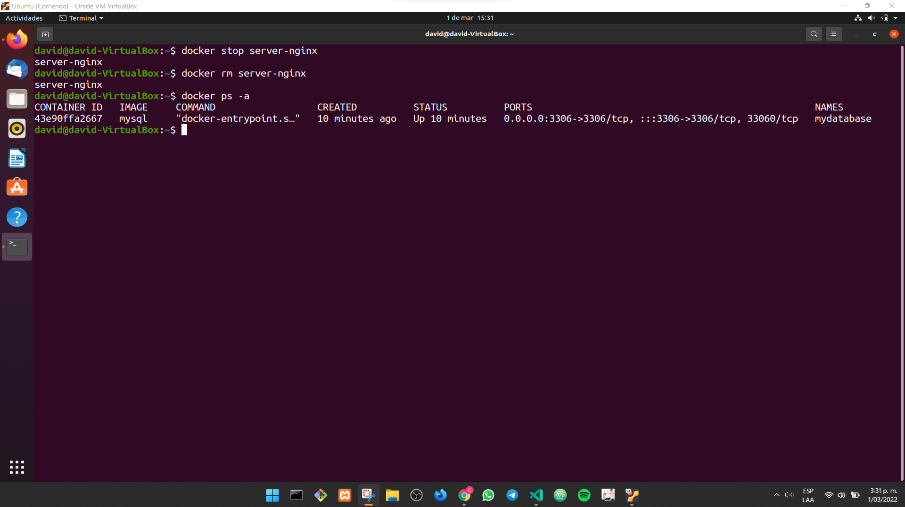

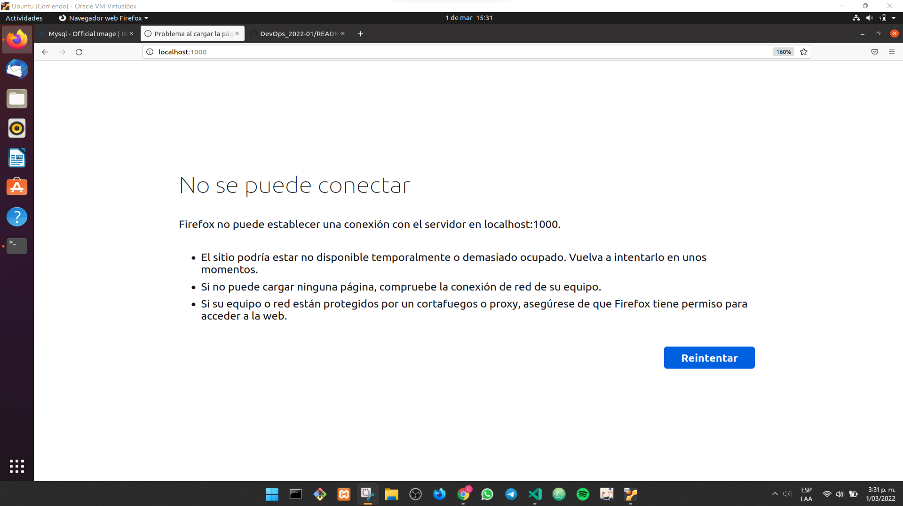

## Listar los contenedores con propiedades especificas

```txt
~$ docker ps -aq --format="ID\t{{.ID}}"
```

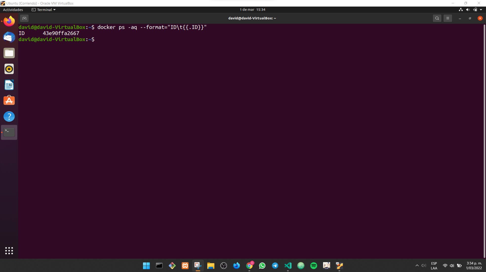

```txt
~$ docker ps -aq --format="Nombres\t{{.Names}}"
```

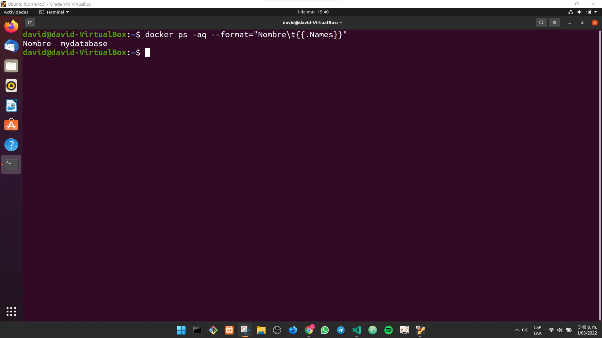

```txt
~$ docker ps -aq --format="ID\t{{.ID}}\nNombres\t{{.Names}}"
```

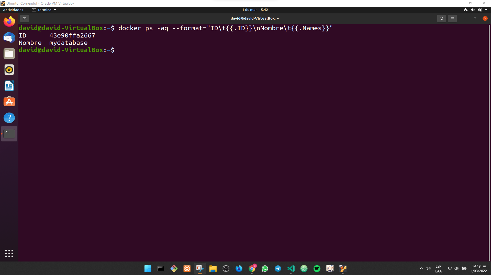
