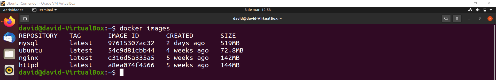
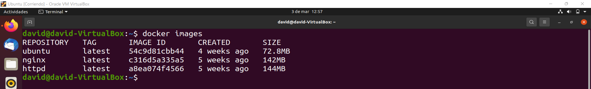

# Operaciones con Imágenes - Subir un proyecto a un contenedor de NGINX en Docker

> Guía diseñada por: ***Carlos David Páez Ferreira***
>
> Guía liderada por: ***Harvey Nicolás Echavarria Ortiz***
>
> Fecha: ***03 de Marzo de 2022***

## `--format`

### Editar el valor de la variable de entorno de sistema para `--format`

```txt
~$ nano ~/.bashrc
```


Al final del archivo añadimos la siguiente línea:

```py
# Environment variable for DOCKER: --format
export DOCKER_FORMAT="ID\t{{.ID}}\nNAME\t{{.Names}}\nPORT\t{{.Ports}}\nSTATUS\t{{.Status}}\nCOMMAND\t{{.Command}}\nCREATED\t{{.CreatedAt}}\nSIZE\t{{.Size}}\n"
```


Presionamos `Ctrl + O` para guardar los cambios, `Enter` para confirmar y `Ctrl + X` para cerrar el editor nano.


### Cargar los cambios del archivo `.bashrc`

```txt
~$ source ~/.bashrc
```


### Imprimir el valor de la variable `DOCKER_FORMAT`

```txt
~$ echo $DOCKER_FORMAT
```


### Imprimir la lista de contenedores activos con la bandera `--format`

```txt
~$ docker ps --format="$DOCKER_FORMAT"
```


```txt
~$ docker ps -aq --format="$DOCKER_FORMAT"
```


## Operaciones con Imágenes

### Listar todas las imágenes

```txt
~$ docker images
```


### Remover una imagen

```txt
~$ docker rmi hello-world
```


```txt
~$ docker images
```



### Intentar remover una imagen con contenedores activos

```txt
~$ docker rmi mysql
```


### Remover una imagen de manera forzada

```txt
~$ docker rmi mysql -f
```


```txt
~$ docker images
```



### Renovar una imagen por su ID

Podemos remover una imagen por su nombre, como se hizo anteriormente, o eliminarla mediante su ID o las 3 iniciales del mismo. En este caso queremos eliminar la imagen de Ubuntu.

```txt
~$ docker rmi 54c
```


```txt
~$ docker images
```


### Listar los ID de las imágenes

```txt
~$ docker image -aq
```


### Remover todas las imágenes mediante una arreglo

```txt
~$ docker rmi $(docker images -aq)
```


Se muestra un error por qué hay contenedores corriendo en el momento.

### Listar contenedores activos

```txt
~$ docker ps
```


### Listar todos los contenedores disponibles

```txt
~$ docker ps -a
```


### Remover todos los contenedores de manera forzada

```txt
~$ docker rm $(docker ps -aq) -f
```


```txt
~$ docker ps -a
```


### Eliminar todas la imágenes

```txt
~$ docker rmi $(docker images -aq)
```


```txt
~$ docker images
```


## Subir un proyecto a un contenedor de NGINX

### Creación de un proyecto

Creamos un directorio en donde guardaremos el código de nuestro proyecto.


Dentro de un editor de código, o un IDE, creamos 2 archivos: `index.html` y `about.html`. La estructura del primero será la siguiente:


El contenido de `about.html` será el siguiente:


### Correr el proyecto en un servidor Web

Necesitamos volver a instalar la imagen de NGINX:

```txt
~$ docker pull nginx
```


Para conocer el directorio de nuestro proyecto, podemos correr dentro de la terminar de VSCode el comando:

```txt
~$ pwd
```


Luego ponemos a correr un contenedor de la imagen NGINX con el código de nuestro proyecto:

```txt
~$ docker run -d -p 3000:80 --name WebSite -v $(pwd):/usr/share/nginx/html:ro nginx
```


Podemos observar los contenedores disponibles con el siguiente comando:

```txt
~$ docker ps -as
```


Si vamos al navegador, podemos observar lo siguiente:


### Realizar cambios al código

En caso de que hagamos cambios a uno de los archivos, solo debemos guardar y se podrá evidenciar el cambio en el navegador sin necesidad de tocar el contenedor.


### Observar los contenedores activos con la bandera `--format`

```txt
~$ docker ps --format="$DOCKER_FORMAT"
```


