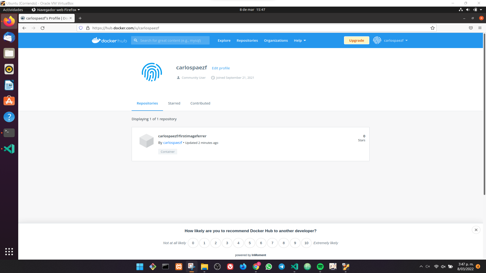

# Crear una imagen propia y subirla a Docker Hub

## Retomando el proyecto de la sección anterior

### Detener contenedores pasados

Cuando corremos el contenedor con el proyecto, en caso de tener otro contenedor con el mismo contenido, debemos detenerlo y eliminarlo y levantar nuestro proyecto:

```txt
~$ docker rm WebSite -f
```


### Correr un contenedor con nuestro proyecto

Dentro de VSCode, en la terminal ubicada en nuestro proyecto corremos el comando para levantar un contenedor en modo de solo lectura (`:ro`), en segundo plano (`-d`):

```txt
~$ docker run -d -p 3000:80 --name WebSite -v $(pwd):/usr/share/nginx/html:ro nginx
```


### Listar todos los contenedores disponibles con la variable de entorno

```txt
~$ docker ps --format="$DOCKER_FORMAT"
```


### Entrar al contenedor en modo iterativo con `-it`

```txt
~$ docker exec -it WebSite bash
```


### Ingresar a los archivos usando el bash del contenedor

```txt
~$ cd /usr/share/nginx/html
```

```txt
~$ ls -l
```


```txt
~$ exit
```


### Crear un nuevo archivo mediante consola

```txt
~$ touch newFile.html
```


### Evitar el modo lectura

En caso de que se muestre error por estar en modo lectura el contenedor, debemos detener y remover el contenedor, y luego poner a correr un nuevo contenedor evitando la bandera `:ro`. Luego si podemos intentar crear el archivo.

```txt
~$ docker stop WebSite
```

```txt
~$ docker rm WebSite
```

```txt
~$ docker run -d -p 3000:80 --name WebSite -v $(pwd):/usr/share/nginx/html nginx
```


## Configurar nuestra primera imagen

### Crear un README

```txt
~$ touch README.md
```


### Crear un archivo Dockerfile

```txt
~$ touch Dockerfile
```


### Instalar la extensión DOCKER


### Configurar el archivo DOCKERFILE

Debemos tomar una versión determinada de la imagen **NGINX**, luego definimos el directorio donde vamos a trabajar, y por último definimos que todo lo que trabajemos se suba al contenedor.

```dockerfile
FROM nginx:latest

WORKDIR /usr/share/nginx/html

COPY . .
```


### Convertir nuestro proyecto en imagen

Es importante que el nombre del archivo que configura Docker, sea `Dockerfile`, con el fin de que no cause problemas al momento de generar la imagen.


Usamos el comando `build` para generar nuestra imagen, pero con un nombre especifico y apuntando al directorio actual `.`

```txt
~$ docker build -t firstimageferrer .
```


Removemos el contenedor de nuestro proyecto que actualmente está corriendo:

```txt
~$ docker rm WebSite -f
```


Confirmar que tenemos nuestra imagen:

```txt
~$ docker images
```


Corremos un nuevo contenedor usando la imagen que acabamos de generar:

```txt
~$ docker run -p 1000:80 -d --name WebSite firstimageferrer
```


```txt
~$ docker ps --format="$DOCKER_FORMAT"
```


Confirmar en un navegador que nuestro contenedor esté funcionando:


## Subir la imagen a DockerHub

### Iniciar sesión mediante la consola

```txt
~$ docker login
```


### Construimos una imagen como repositorio

```txt
~$ docker build -t carlospaezf/firstimageferrer .
```


### Subir la imagen mediante comando

```txt
~$ docker push carlospaezf/firstimageferrer
```


Verificar que se haya subido la imagen a nuestra cuenta de DockerHub:




