# Subir una WebSite más compleja como imagen a DockerHub

## Crear un proyecto

Creamos un nuevo proyecto en el que tendremos algún archivos de html y de css. También podemos implementar Bootstrap dentro de nuestra página web.

## Correr nuestro proyecto en un contenedor de NGINX

```txt
~$ docker run d -p 3000:80 --name WebSiteDockerHub -v $(pwd):/usr/share/nginx/html:ro nginx
```

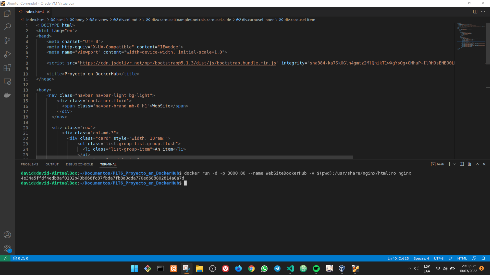

## Listar los contenedores con formato

```txt
~$ docker ps --format="$DOCKER_FORMAT"
```

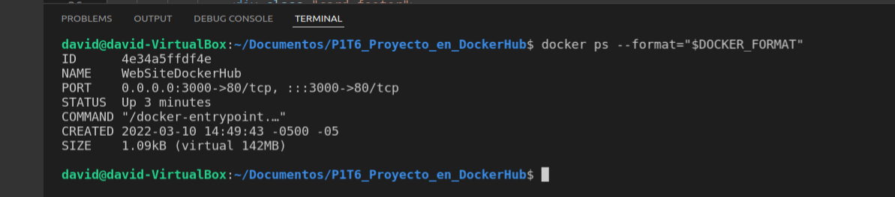

## Ver el proyecto en el navegador

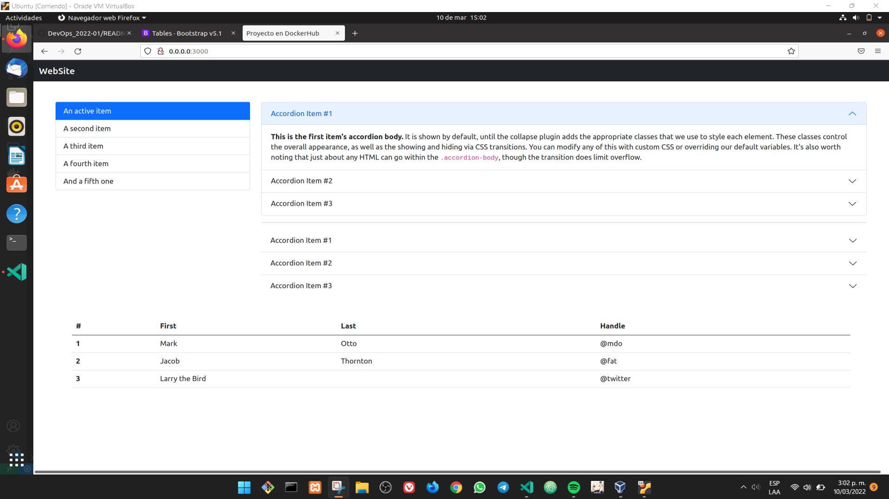

## Iniciar sesión de Docker desde la consola

```txt
~$ docker login
```

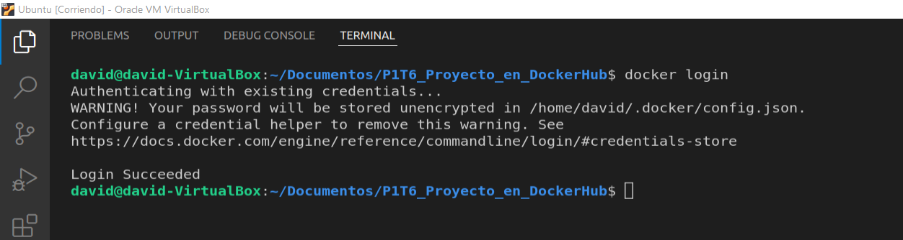

## Construir la imagen con el proyecto

```txt
~$ docker build -t carlospaezf/websitedockerhub .
```

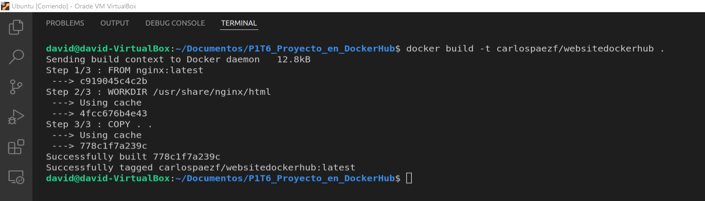

## Subir la imagen a nuestro repositorio de Docker Hub

```txt
~$ docker push carlospaezf/websitedockerhub
```

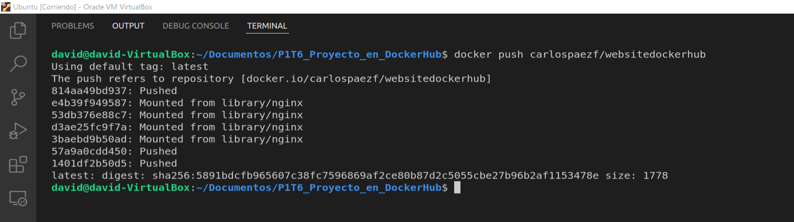

## Observar la imagen en nuestra cuenta

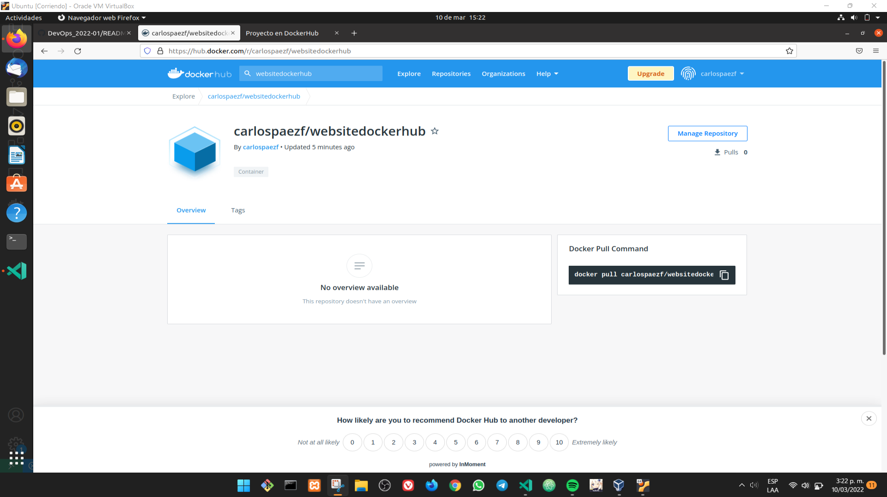

## Remover todos los contenedores

```txt
~$ docker rm $(docker ps -aq) -f
```

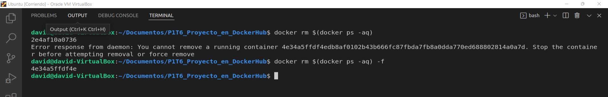

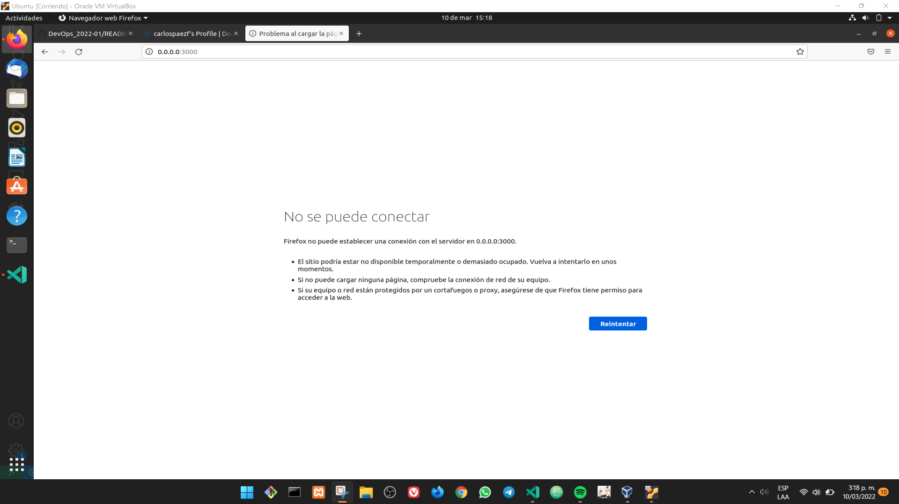

## Descargar la imagen de nuestro repositorio

```txt
~$ docker pull carlospaezf/websitedockerhub
```

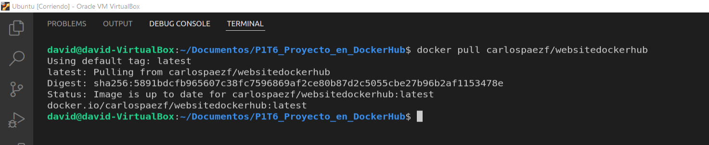

## Listar todas las imágenes en el equipo

```txt
~$ docker images -a
```

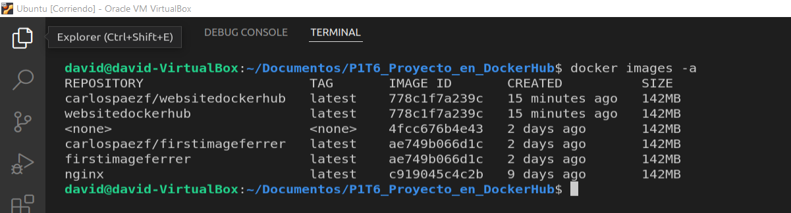

## Correr un contenedor con nuestra imagen descargada

```txt
~$ docker run -d -p 2000:80 ---name WebSiteDescargada carlospaezf/websitedockerhub
```

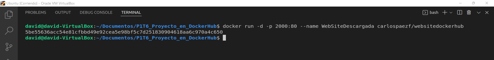

## Listar nuestros contenedores

```txt
~$ docker ps --format="$DOCKER_FORMAT"
```

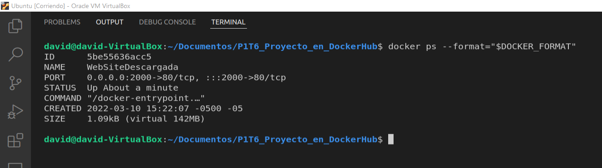

## Observar nuestro contenedor corriendo


