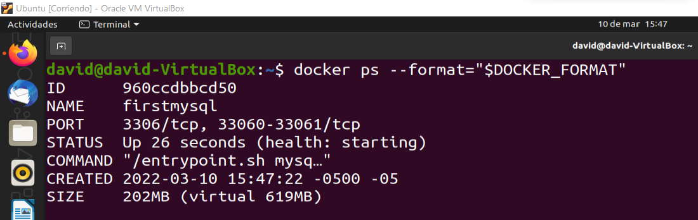
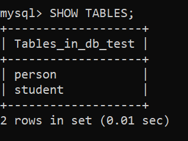
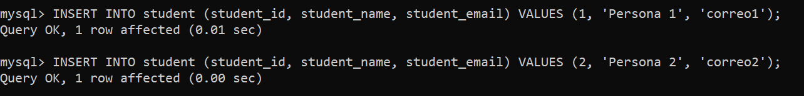

# MySQL Server

> Guía elaborada por: ***Carlos David Páez Ferreira***
>
> Guía Liderada por: ***Harvey Nicolás Echavarria Ortiz***
>
> Fecha: ***17 Marzo 2022***

## Instalar la imagen de MySQL

```txt
~$ sudo docker pull mysql/mysql-server:latest
```


## Correr un contenedor con MySQL

```txt
~$ docker run --name=firstmysql -d mysql/mysql-server:latest
```


## Listar los contenedores activos

```txt
~$ docker ps --format="$DOCKER_FORMAT"
```



## Instalar MySQL-Client

```txt
~$ sudo apt-get install mysql-client
```


## Listar las imágenes almacenadas

```txt
~$ docker images
```


## Mostrar los logs del contenedor

```txt
~$ docker logs firstmysql
```


## Ejecutar la consola interactiva

```txt
~$ docker exec -it firstmysql bash
```


## Ingresar las credenciales de mysql

```txt
~$ mysql -u root -p
```


## Tener en cuenta la contraseña


## Cambiar la contraseña del Root

```txt
mysql> ALTER USER 'root'@'localhost' INDENTIFIED BY 'root_password';
```


## Comandos en SQL

### Mostrar bases de datos

```sql
SHOW databases;
```


### Crear una base de datos

```sql
CREATE DATABASE db_test;
```


### Usar la base de datos

```sql
USE db_test;
```


### Crear una nueva tabla

```sql
CREATE TABLE person (person_id INT, person_name VARCHAR(50), person_email VARCHAR(50));
```


### Mostrar las tablas actuales

```sql
SHOW TABLES;
```


### Crear una tabla para estudiantes

```sql
CREATE TABLE student (student_id INT, student_name VARCHAR(50), student_email VARCHAR(50));
```


### Mostrar las nuevas tablas

```sql
SHOW TABLES;
```



### Mostrar las columnas de la tabla persona

```sql
DESCRIBE person;
```


### Insertar datos en la tabla persona

```sql
INSERT INTO person (person_id, person_name, person_email) VALUES (1, 'Persona 1', 'correo1');
```

```sql
INSERT INTO person (person_id, person_name, person_email) VALUES (2, 'Persona 2', 'correo2');
```


### Mostrar las columnas de la tabla student

```sql
DESCRIBE student;
```


### Insertar datos en la tabla de student

```sql
INSERT INTO student (student_id, student_name, student_email) VALUES (1, 'Estudiante 1', 'correo1');
```

```sql
INSERT INTO student (student_id, student_name, student_email) VALUES (2, 'Estudiante 2', 'correo2');
```



### Mostrar todos los datos de persona

```sql
SELECT * FROM person;
```


### Mostrar todos los datos de estudiantes

```sql
SELECT * FROM student;
```


### Salir de la consola

```sql
EXIT;
```


