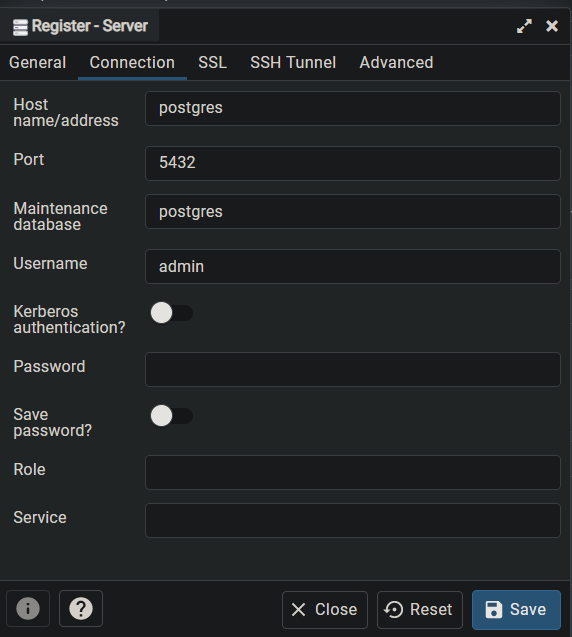

# PostgreSQL y PGAdmin

> Guía elaborada por: ***Carlos David Páez Ferreira***
>
> Guía Liderada por: ***Harvey Nicolás Echavarria Ortiz***
>
> Fecha: ***17 Marzo 2022***

En Windows podemos instalar Docker Desktop, el cual incluye Docker Compose.


## Crear un nuevo directorio para un proyecto


## Crear un archivo docker-compose.yml


## Verificar la última versión de Docker Compose

Necesitamos ingresar a [Compose file versions and upgrading](https://docs.docker.com/compose/compose-file/compose-versioning/) para poder verificar la última versión de Docker Compose.

## Modificar el archivo docker-compose.yml

```yml
version: '3.8'

services:

    postgres:
        image: postgres
        restart: always
        ports:
            - "5432:5432"
        environment:
            - DATABASE_HOST=127.0.0.1
            - POSTGRES_USER=root
            - POSTGRES_PASSWORD=root
            - POSTGRES_BD=root

    pgadmin:
        image: dpage/pgadmin4
        environment:
            PGADMIN_DEFAULT_EMAIL: "admin@admin.com"
            PGADMIN_DEFAULT_PASSWORD: "admin"
        ports:
            - "80:80"
        depends_on:
            - postgres
```

## Instalar la imagen de postgres

```txt
~$ docker pull postgres
```


## Instalar la imagen de pgadmin4

```txt
~$ docker pull dpage/pgadmin4
```


## Hacer pull a Postgres con Compose

```txt
~$ docker-compose up
```


## Iniciar sesión desde el navegador


```yml
PGADMIN_DEFAULT_EMAIL: "admin@admin.com"
PGADMIN_DEFAULT_PASSWORD: "admin"
```


## Verificar que los contenedores estén corriendo

```txt
~$ docker ps
```


## Registrar un nuevo servidor dentro de PGAdmin

Sobre `Servers`, pulsamos click derecho y seleccionamos la opción > **Register** > **Server**. Luego le asignamos un nombre al server en la pestaña de **General**:


Dentro de la pestaña de **Connection** añadimos un Host name/address y el username asignado:


