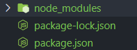
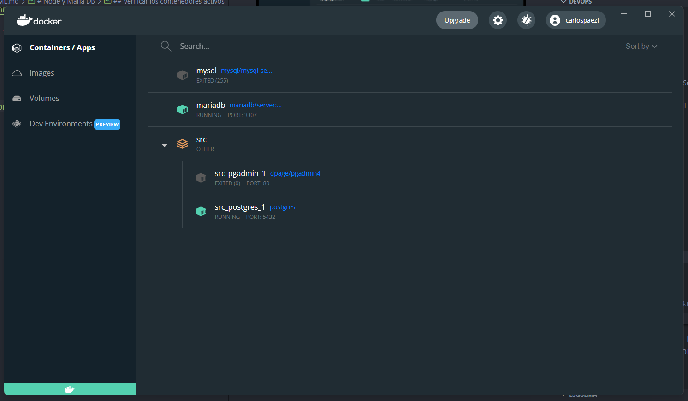
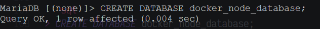
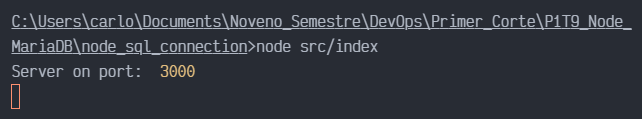

# Node y Maria DB

## Verificar las instalaciones de Docker y Node

```txt
~$ docker --version
```

```txt
~$ node --version
```


## Crear un directorio para el proyecto


## Inicializar el proyecto de node

```txt
~$ npm init -y
```


## Contenido inicial del package.json


## Instalar los paquetes necesarios

```txt
~$ npm i express mariadb
```


## Verificar que ya estén los node_modules




## Crear un archivo index.js

En este archivo configuramos nuestro primer servidor.


## Crear un archivo database.js

En este archivo establecemos la configuración con nuestra base de datos en MariaDB


## Correr un contenedor con la imagen de MariaDB v. 10.4

```txt
~$ docker run -d -p 3307:3306 --name mariadb -e MYSQL_ROOT_PASSWORD=password mariadb/server:10.4
```


## Verificar que la imagen se haya instalado

```txt
~$ docker images
```


## Verificar los contenedores activos

```txt
~$ docker ps
```




## Validar el acceso a MariaDB

```txt
~$ mysql --host 127.0.0.1 -P 3307 -u root -p
```


## Ejecutar sentencias SQL

### Mostrar las bases de datos

```sql
> SHOW DATABASES;
```


### Crear una nueva DB

```sql
> CREATE DATABASE docker_node_database;
```



```sql
> SHOW DATABASES;
```


### Usar la base de datos recién creada

```sql
> USE docker_node_database;
```


### Seleccionar la base de datos

```sql
> SELECT DATABASE();
```


### Crear una nueva tabla

```sql
> CREATE TABLE products(name VARCHAR(100));
```


### Describir el contenido de la tabla productos

```sql
> DESCRIBE products;
```


### Insertar algunos registros

```sql
> INSERT INTO products VALUES ('laptop'), ('mouse'), ('keyboard');
```


### Listar los registros

```sql
> SELECT * FROM products;
```


## Conexión a MariaDB


## index.js


## Correr el servidor

Vamos a correr el servidor con algunos de los siguientes 2 comandos:

```txt
~$ node src/index.js
```

```txt
~$ npm run dev
```



## Acceder al servicio

Entramos a la ruta `http://localhost:3000/products`


## Probar en algún API Client

Vamos a hacer la prueba del endpoint dentro de Postman.


