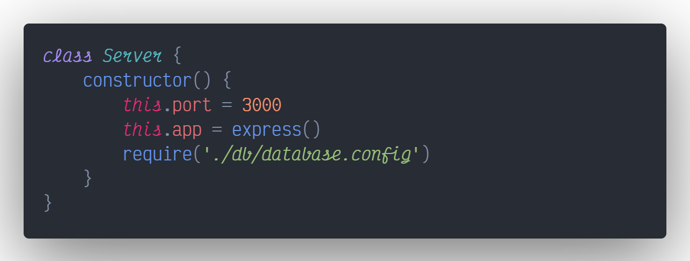

# Node y MongoDB

> Guía elaborada por: ***Carlos David Páez Ferreira***
>
> Guía Liderada por: ***Harvey Nicolás Echavarria Ortiz***
>
> Fecha: ***29 Marzo 2022***

## Crear un nuevo directorio para el proyecto


## Inicializar el proyecto de Node


## Configurar los scripts del proyecto

Dentro del archivo `package.json` configuramos un comando para levantar el proyecto.

```json
{
    ...,
    "scripts": {
        ...,
        "start": "node src/index.js"
    },
}
```

## Instalar los módulos necesarios

```txt
npm i express mongoose
```


## Creación del archivo `index.js`

Dentro de la carpeta `src` creamos un archivo llamado `index.js`, el cual será el centro de nuestro proyecto.


## Creación del archivo `database.js`

Dentro de la carpeta `db` creamos un archivo llamado `database.config.js`, en el cual configuramos la conexión con la base de datos.


## `index.js`

El archivo `index.js` tendrá el siguiente contenido:


## Correr el proyecto

Usamos el script que configuramos para levantar el proyecto

```txt
npm run start
```


Si accedemos desde el navegador, no vamos a encontrar nada puesto que no hemos configurado rutas en nuestra aplicación.


## Creación del archivo `Dockerfile`

Creamos un archivo llamado `Dockerfile`:


El contenido dentro del mismo será lo siguiente:


## `.dockerignore`

Creamos un archivo llamado `.dockerignore` para poder ignorar los archivos o directorios que no deben ir dentro del contenedor.


El contenido del archivo será lo siguiente:

```txt
node_modules
```

## Modificación al archivo `Dockerfile`

Vamos a añadir unas cuantas líneas al archivo `Dockerfile`:


## Descargar la imagen de Node y ejecutar los comandos uno a uno

```txt
docker build -t hellonode .
```


## Listar las imágenes actuales

```txt
docker images
```


## Correr la imagen de `hellonode`

```txt
docker run -p 4000:3000 hellonode
```

El puerto 4000 es por donde escucha nuestra maquina, y el puerto 3000 es el puerto configurado para nuestro servidor.


Ahora validamos en el navegador:


Por el momento, cancelamos el proceso con `Ctrl + C` en la terminal.

## `docker-compose.yml`

Necesitamos un archivo que nos permita componer distintas imágenes, para ello creamos el archivo `docker-compose.yml` en la raíz del proyecto


El contenido de dicho archivo será el siguiente:


## Configurar la conexión con la base de datos

Dentro del archivo `database.config.js` tenemos la siguiente configuración:


## Docker-Compose

Ejecutamos el siguiente comando:

```txt
docker-compose build
```


Cuando ejecutamos el comando para listar imágenes de Docker, podemos observar que tenemos una nueva imagen llamada `p2t1_node_mongo_web`:

```txt
docker images
```


Para probar nuestra imagen podemos usar el siguiente comando:

```txt
docker-compose up
```


Para poder ver la cadena de conexión a nuestra base de datos debemos añadir una línea al constructor de nuestro servidor, en la cual requerimos la configuración de la base de datos:



Debemos detener el contenedor, volverlo a construir y volverlo a lanzar:

```txt
docker-compose build
```


```txt
docker-compose up
```


## Archivos de rutas en la aplicación

Primero detenemos el proceso en consola con el comando `Ctrl + C`. Luego, creamos un directorio llamado `src/routes`, y dentro del mismo creamos un archivo llamado `index.routes.js`


Luego dentro del archivo `docker-compose.yml` añadimos el término `volumes`, el cual permite copiar en ambas direcciones (del proyecto al contenedor y del contenedor al proyecto), y lo modificamos de la siguiente manera:


Volvemos a construir el proyecto y a levantar el contenedor

```txt
docker-compose build
```


```txt
docker-compose up
```


Para comprobar que funciona la propiedad `volumes`, creamos un archivo llamado `.gitignore` en la raíz del proyecto.


Luego, ejecutamos en terminal el comando para observar los contenedores activos:

```txt
docker ps
```


Posteriormente, ejecutamos el contenedor `exampleapp` en modo interactivo con un bash, y dentro listamos todos los archivos que contiene:

```txt
docker exec -it exampleapp bash
```

```txt
~$ ls -a
```


Como se puede observar, creamos el archivo `.gitignore` desde el proyecto, pero a su vez se creo en el contenedor.

## Nodemon

En una nueva consola del proyecto, instalamos el módulo Nodemon en modo desarrollo con el siguiente comando, esto lo hacemos con el fin de recargar el servidor más fácil ante los cambios:

```txt
npm i nodemon -D
```


Luego, dentro de `package.json`, añadimos un nuevo script para iniciar con nodemon:

```json
{
    ...,
    "scripts": {
        ...,
        "dev": "nodemon src/index.js"
    },
}
```

Dentro del archivo `Dockerfile` hacemos un cambio para que inicie con Nodemon:

```dockerfile
CMD [ "npm", "start", "dev" ]
```

Volvemos a detener el proceso del contenedor, hacemos de nuevo un build y lo volvemos a levantar:

```txt
docker-compose build
```


```txt
docker-compose up
```


## Rutas

Dentro del archivo `index.routes.js` añadimos una ruta que se accede con el verbo GET:


Dentro del archivo `index.js` hacemos los siguientes cambios.


De nuevo, hacemos un build del proyecto y levantamos el contenedor:

```txt
docker-compose build
```


```txt
docker-compose up
```


Podemos ir al navegador y hacer una prueba a nuestro endpoint `http://localhost:5000` (el puerto 5000, es el puerto que se definió dentro del archivo `docker-compose.yml`):


