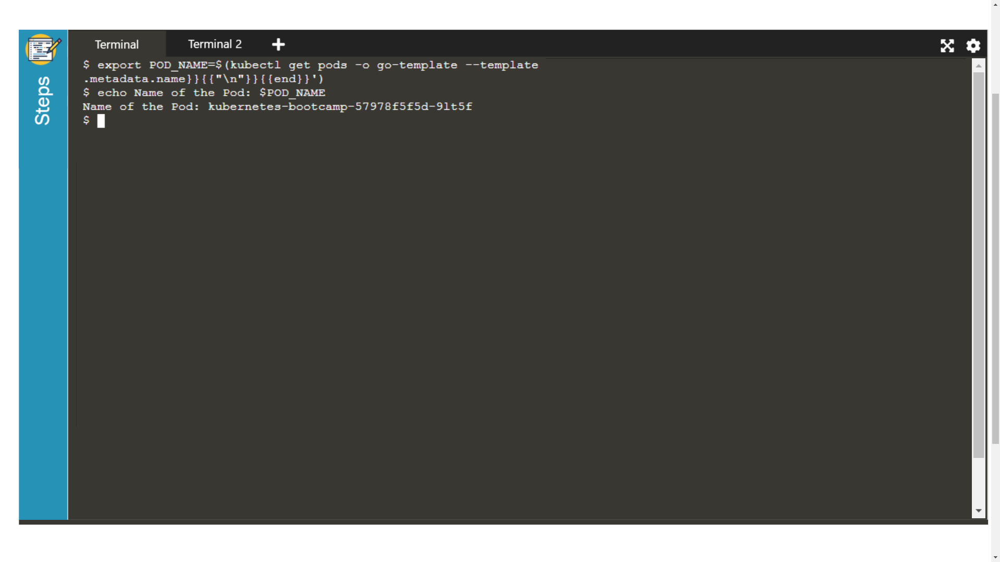
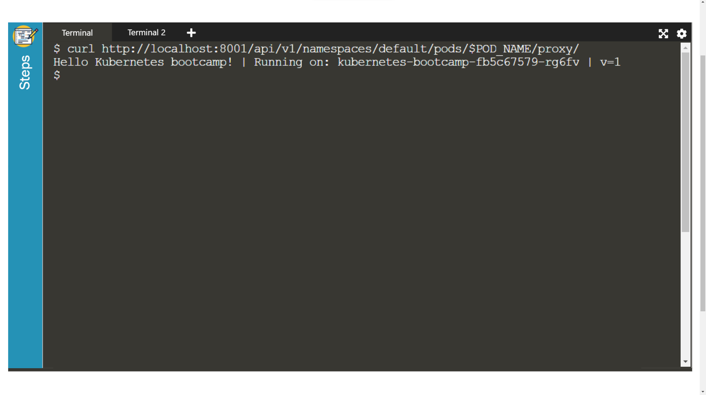
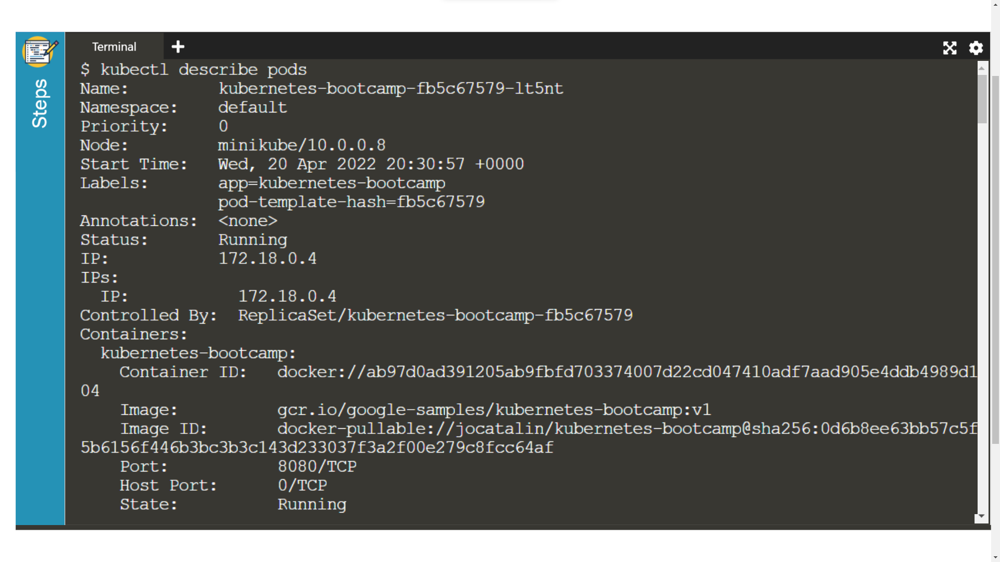
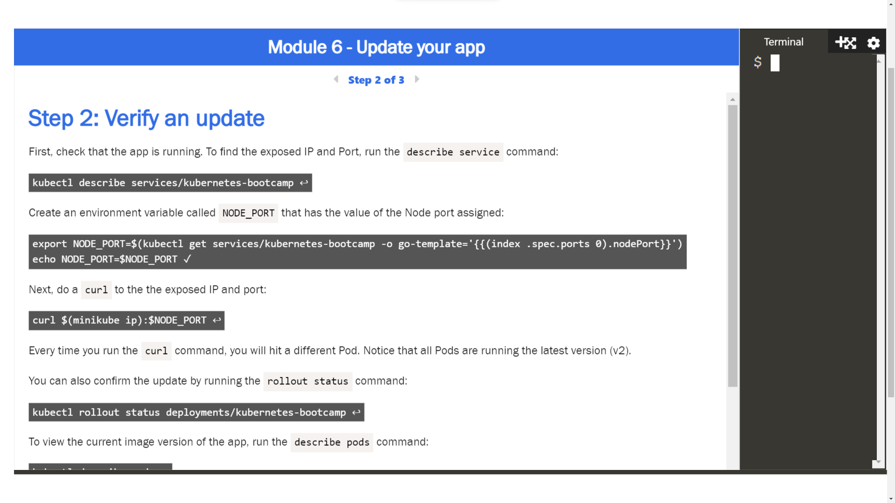

# Kubernetes

> Guía elaborada por: ***Carlos David Páez Ferreira***
>
> Guía Liderada por: ***Harvey Nicolás Echavarria Ortiz***
>
> Fecha: ***19 Abril 2022***

Documentación base: [Learn Kubernetes Basics](https://kubernetes.io/docs/tutorials/kubernetes-basics/)

## Kubernetes Basics Modules


## Módulo 1: Crear un Kubernetes Cluster

Ingresamos a tutorial interactivo, y conectamos el entorno virtual:


### Levantar un Cluster y correrlo

En el paso 1 comenzamos a ingresar los comandos que se nos muestran:


Conocer la versión de minikube:

```txt
minikube version
```

Iniciar el cluster:

```txt
minikube start
```


### Cluster version


Verificar que kubectl esté instalado:

```txt
kubectl version
```


### Detalles del Cluster


Conocer los detalles del cluster:

```txt
kubectl cluster-info
```

Obtener los nodos del cluster:

```txt
kubectl get nodes
```


## Módulo 2: Desplegar una aplicación

Ingresamos al segundo módulo interactivo para desplegar una aplicación dentro de los usando kubectl.


### kubectl básicos


Verificamos si el kubectl está configurado para comunicarse con el cluster y además obtenemos los nodos del módulo:

```txt
kubectl version
```

```txt
kubectl get nodes
```


### Desplegar nuestra aplicación


Ejecutamos el comando para correr una aplicación provista por el bootcamp de Kubernetes:

```txt
kubectl create deployment kubernetes-bootcamp --image=gcr.io/google-samples/kubernetes-bootcamp:v1
```

Para obtener la lista de despliegues realizados, usamos el siguiente comando:

```txt
kubectl get deployments
```


### Visualizar nuestra app


Vamos a abrir una segunda terminal en la que creamos un proxy con kubectl, el cual da paso a las comunicaciones dentro del ancho del cluster en una red privada.

```txt
echo -e "\n\n\n\e[92mStarting Proxy. After starting it will not output a response. Please click the first Terminal Tab\n"; 
kubectl proxy
```


Una vez tenemos la conexión establecida, podemos hacerle una petición al endpoint para obtener la versión:

```txt
curl http://localhost:8001/version
```


Vamos a obtener el nombre del Pod y almacenarlo en una variable de entorno:

```txt
export POD_NAME=$(kubectl get pods -o go-template --template '{{range .items}}{{.metadata.name}}{{"\n"}}{{end}}')
echo Name of the Pod: $POD_NAME
```



Ahora, podemos acceder al Pod a través de la API corriendo:

```txt
curl http://localhost:8001/api/v1/namespaces/default/pods/$POD_NAME/
```


## Módulo 3: Visualización de los Pods y Nodos

Ingresamos al tutorial interactivo del módulo 3 y conectamos el entorno virtual.


### Revisar la configuración de la aplicación


Vamos a revisar que la aplicación que desplegamos, este corriendo:

```txt
kubectl get pods
```


Luego observamos los contenedores que están dentro del Pod y que imágenes los están utilizando:

```txt
kubectl describe pods
```


### Mostrar la app en la terminal


Dentro de una nueva terminal levantamos un proxy para poder acceder a los Pods que están aislados, con el fin de interactuar con ellos y hacer debug.

```txt
kubectl proxy
```


Luego, obtenemos el nombre del Pod y lo guardamos en una variable de entorno, para posteriormente consultarlo:

```txt
export POD_NAME=$(kubectl get pods -o go-template --template '{{range .items}}{{.metadata.name}}{{"\n"}}{{end}}')
echo Name of the Pod: $POD_NAME
```


Luego, mediante curl hacemos una request a nuestra aplicación:

```txt
curl http://localhost:8001/api/v1/namespaces/default/pods/$POD_NAME/proxy/
```



### Ver los logs de los contenedores


Ejecutamos el siguiente comando para obtener los logs de un Pod especifico:

```txt
kubectl logs $POD_NAME
```


### Ejecutar comandos en el contenedor


Vamos a ejecutar un comando para listar las variables de entorno contenidas por el Pod que se está ejecutando:

```txt
kubectl exec $POD_NAME -- env
```


Luego, iniciamos una sesión de terminal dentro del contenedor del Pod:

```txt
kubectl exec -ti $POD_NAME -- bash
```


Teniendo el bash abierto dentro del container, vamos a observar el archivo `server.js` del proyecto NodeJS que está desplegado:

```txt
cat server.js
```


Luego podemos verificar que la aplicación este corriendo dentro del contenedor, con el siguiente comando:

```txt
curl localhost:8080
```


Podemos salir de la terminal del container usando el comando:

```txt
exit
```


## Módulo 4: Exponer la aplicación al público

Abrimos el tutorial interactivo y conectamos la máquina virtual:


### Crear un nuevo servicio


Verificamos que nuestra aplicación está corriendo

```txt
kubectl get pods
```


Luego listamos todos los servicios que están corriendo:

```txt
kubectl get services
```


Para crear un nuevo servicio y exponerlo al trafico externo, nosotros usamos el comando para exponer, teniendo como parámetro el NodePort:

```txt
kubectl expose deployment/kubernetes-bootcamp --type="NodePort" --port 8080
```


De nuevo, listamos todos los servicios:

```txt
kubectl get services
```


Para encontrar el puerto que está siendo abierto externamente, usamos el siguiente comando:

```txt
kubectl describe services/kubernetes-bootcamp
```


Creamos una variable de entorno con el valor del puerto dl nodo asignado:

```txt
export NODE_PORT=$(kubectl get services/kubernetes-bootcamp -o go-template='{{(index .spec.ports 0).nodePort}}')
echo NODE_PORT=$NODE_PORT
```


Luego testeamos la app expuesta usando curl, la Ip del nodo y el puerto de exposición externo:

```txt
curl $(minikube ip):$NODE_PORT
```


### Usar labels


Podemos observar el nombre por defecto que se asigno al Pod:

```txt
kubectl describe deployment
```


También podemos listar un pod con un label especifico:

```txt
kubectl get pods -l app=kubernetes-bootcamp
```


O también podemos listar un servicio por su nombre:

```txt
kubectl get services -l app=kubernetes-bootcamp
```


Ahora, obtenemos el nombre del Pod y lo guardamos en una variable de entorno:

```txt
export POD_NAME=$(kubectl get pods -o go-template --template '{{range .items}}{{.metadata.name}}{{"\n"}}{{end}}')
echo Name of the Pod: $POD_NAME
```


Vamos a aplicar un nuevo label:

```txt
kubectl label pods $POD_NAME version=v1
```


Ahora podemos listar el pod con el nuevo label:

```txt
kubectl describe pods $POD_NAME
```


Hacemos una consulta para listar todos los pods que están usando nuestro nuevo label:

```txt
kubectl get pods -l version=v1
```


### Borrar un servicio


Podemos eliminar un servicio usando el label relacionado al mismo:

```txt
kubectl delete service -l app=kubernetes-bootcamp
```


Confirmamos que se haya eliminado:

```txt
kubectl get services
```


Para confirmar que la ruta no está expuesta, usamos curl:

```txt
curl $(minikube ip):$NODE_PORT
```


Con el anterior comando comprobamos que la app no estaba expuesta al público, pero con el siguiente comando, podemos comprobar que la app se mantienen corriendo en el Pod:

```txt
kubectl exec -ti $POD_NAME -- curl localhost:8080
```


## Módulo 5: Ejecutar múltiples instancias de nuestra app

Iniciamos el tutorial interactivo del módulo


### Escalar un despliegue


Listamos los despliegues:

```txt
kubectl get deployments
```


Para observar el ReplicaSet creado por el despliegue, ejecutamos el siguiente comando:

```txt
kubectl get rs
```


Lo siguiente será escalar el despliegue a 4 replicas:

```txt
kubectl scale deployments/kubernetes-bootcamp --replicas=4
```


Listamos de nuevo los despliegues:

```txt
kubectl get deployments
```


Verificar si el número de pods ha cambiado:

```txt
kubectl get pods -o wide
```


Podemos revisar los cambios en los events log del despliegue:

```txt
kubectl describe deployments/kubernetes-bootcamp
```


### Balanceo de Carga


Para encontrar la IP expuesta y el puerto, podemos usar el siguiente comando para describir el servicio:

```txt
kubectl describe services/kubernetes-bootcamp
```


Creamos una variable de entorno que contenga el puerto del nodo:

```txt
export NODE_PORT=$(kubectl get services/kubernetes-bootcamp -o go-template='{{(index .spec.ports 0).nodePort}}')
echo NODE_PORT=$NODE_PORT
```


Luego, hacemos múltiples peticiones a la IP y puerto expuesto, esto para demostrar que en cada petición la carga se balancea con los diferentes Pods:

```txt
curl $(minikube ip):$NODE_PORT
```


### Reducir proporcionalmente


Para reducir el servicio a 2 replicas, usamos el siguiente comando:

```txt
kubectl scale deployments/kubernetes-bootcamp --replicas=2
```


Para listar los despliegues y revisar los cambios usamos el siguiente comando:

```txt
kubectl get deployments
```


Ahora listamos el número de pods:

```txt
kubectl get pods -o wide
```


## Módulo 6: Ejecutar una actualización continua

Levantamos la máquina virtual del módulo 6.


### Actualizar la versión de la aplicación


Listamos los despliegues:

```txt
kubectl get deployments
```


Listamos los Pods:

```txt
kubectl get pods
```


Para ver la versión actual de la imagen de la aplicación usamos el siguiente comando:

```txt
kubectl describe pods
```



Para actualizar la versión de nuestra imagen usamos el siguiente comando:

```txt
kubectl set image deployments/kubernetes-bootcamp kubernetes-bootcamp=jocatalin/kubernetes-bootcamp:v2
```


El comando anterior notifica al despliegue que use diferentes imágenes en nuestra app para una actualización constante. Cuando listamos los pods, podemos observar que el último ha sido terminado:

```txt
kubectl get pods
```


### Verificar una actualización




Verificamos la IP y puerto expuesto de la app corriendo:

```txt
kubectl describe services/kubernetes-bootcamp
```


Guardamos el puerto del nodo en una variable de entorno:

```txt
export NODE_PORT=$(kubectl get services/kubernetes-bootcamp -o go-template='{{(index .spec.ports 0).nodePort}}')
echo NODE_PORT=$NODE_PORT
```


Hacemos una petición a la IP expuesta:

```txt
curl $(minikube ip):$NODE_PORT
```


Podemos confirmar la actualización con el siguiente comando:

```txt
kubectl rollout status deployments/kubernetes-bootcamp
```


Observamos la versión actual de la imagen al listar los pods:

```txt
kubectl describe pods
```


### Retroceder una actualización


Vamos a lanzar una nueva actualización:

```txt
kubectl set image deployments/kubernetes-bootcamp kubernetes-bootcamp=gcr.io/google-samples/kubernetes-bootcamp:v10
```


Observamos el estatus del despliegue:

```txt
kubectl get deployments
```


Listamos todos los Pods:

```txt
kubectl get pods
```


Algunos Pods tienen el error `ImagePullBackOff`, por lo que ejecutamos el siguiente comando para más detalles:

```txt
kubectl describe pods
```


En la sección de los eventos de salida en los pods afectados, podemos observar que el error se ocasiona por que no se encuentra la nueva versión en el repositorio. Para retroceder a la última versión, usamos el siguiente comando:

```txt
kubectl rollout undo deployments/kubernetes-bootcamp
```


De nuevo listamos los pods para observar los cambios:

```txt
kubectl get pods
```


Para observar la versión de la imagen que están corriendo nuestro pods, usamos el siguiente comando:

```txt
kubectl describe pods
```


