# Kubernetes

> Guía elaborada por: ***Carlos David Páez Ferreira***
>
> Guía Liderada por: ***Harvey Nicolás Echavarria Ortiz***
>
> Fecha: ***26 Abril 2022***

## Descarga

Ingresamos a la documentación oficial de minikube para descargar el instalador para Windows: [Minikube - Get Started!](https://minikube.sigs.k8s.io/docs/start/)

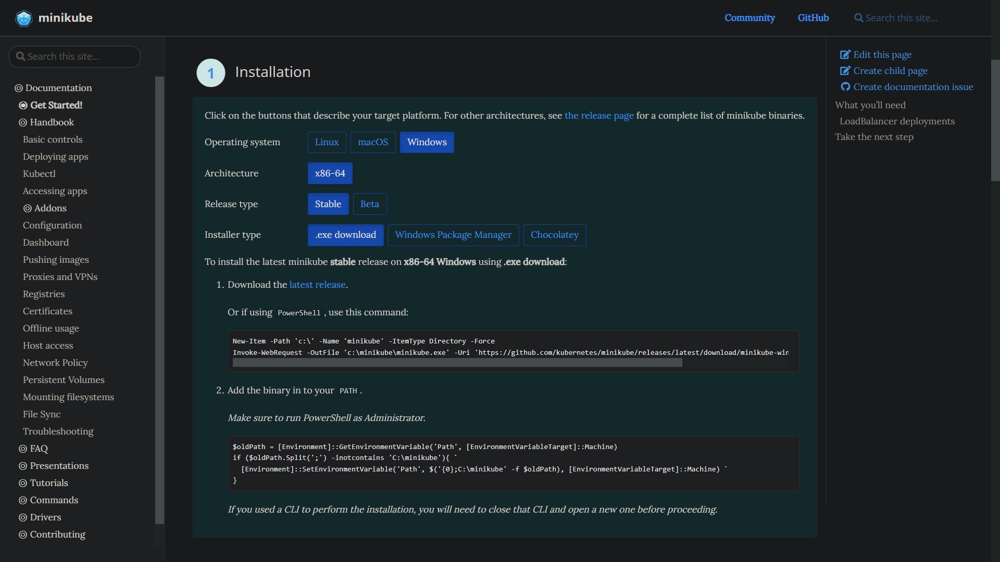

Hacemos la instalación:

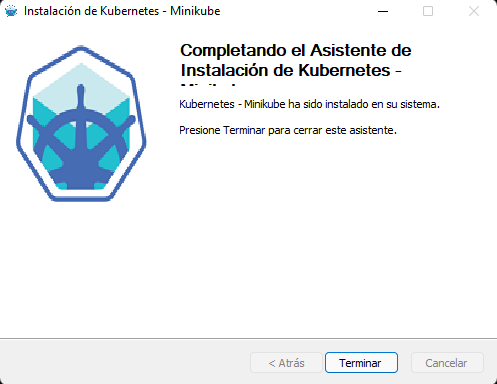

## Iniciar Minikube

Dentro de una terminal ejecutamos el siguiente comando (Es importante tener Docker Desktop ejecutándose):

```txt
minikube start --driver=docker
```

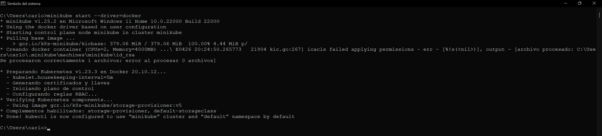

## Listar complementos de Minikube

Listamos los componentes disponibles con el siguiente comando:

```txt
minikube addons list
```

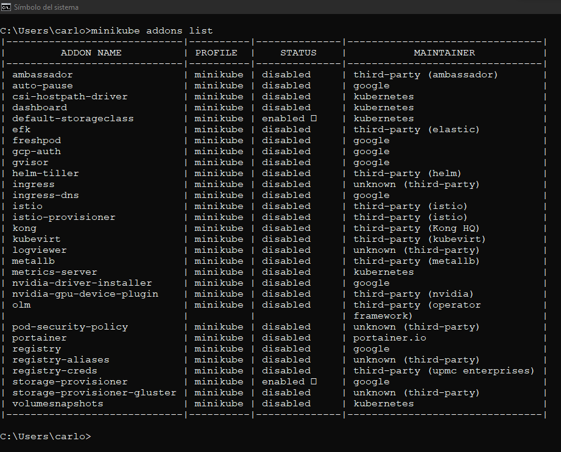

## Levantar complementos con una configuración especifica

Iniciamos minikube con diferentes configuraciones de algunos complementos, corriendolo en el puerto 6443

```txt
minikube start --addons volumesnapshot,csi-hostpath-driver --apiserver-port=6443 --container-runtime=containerd -p mc-demo --kubernetes-version=1.21.2
```

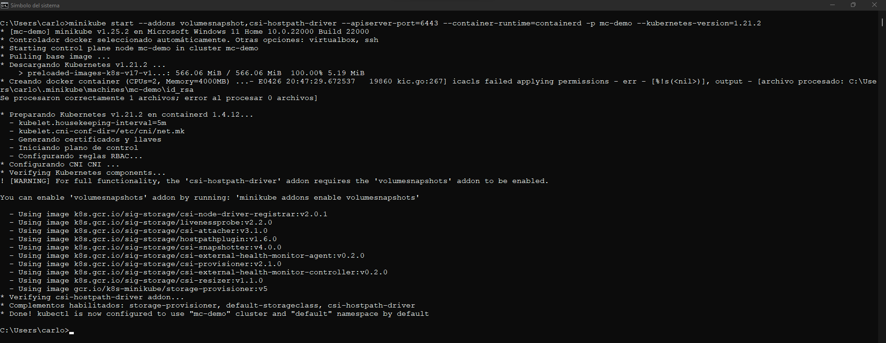

## Instalación de Chocolatey

Para instalar Chocolatey mediante CMD en modo administrador, usamos el siguiente comando:

```txt
@"%SystemRoot%\System32\WindowsPowerShell\v1.0\powershell.exe" -NoProfile -InputFormat None -ExecutionPolicy Bypass -Command "[System.Net.ServicePointManager]::SecurityProtocol = 3072; iex ((New-Object System.Net.WebClient).DownloadString('https://community.chocolatey.org/install.ps1'))" && SET "PATH=%PATH%;%ALLUSERSPROFILE%\chocolatey\bin"
```

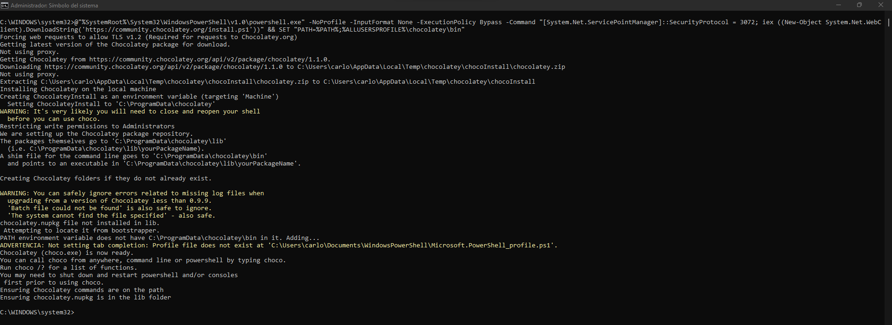

## Instalación de Kubectl con Chocolatey

Usaremos el siguiente comando para instalar Kubectl con Chocolatey:

```txt
choco install kubernetes-cli
```

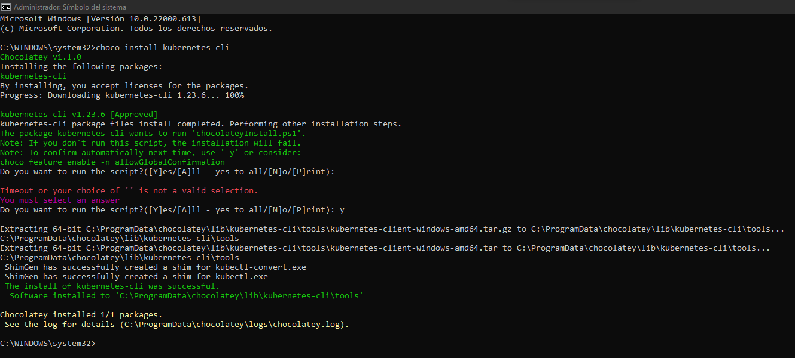

## Comandos de Kubectl

### Obtener los nodos mediante Kubectl

Listamos los nodos actualmente activos:

```txt
kubectl get nodes
```

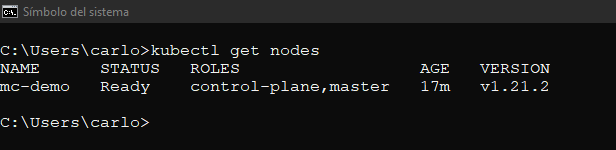

### Listar los pods con Kubectl

```txt
kubectl get pods
```

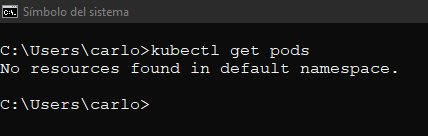

### Listar los namespaces

```txt
kubectl get namespaces
```

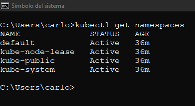

### Describir los nodos

```txt
kubectl describe nodes
```

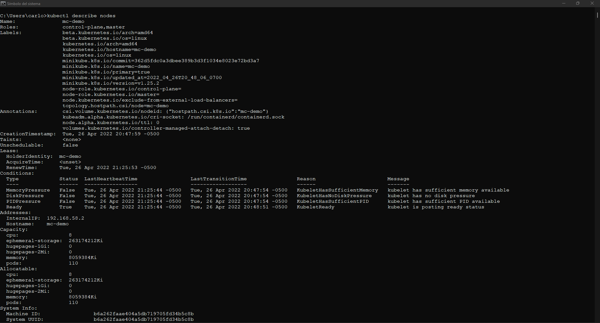
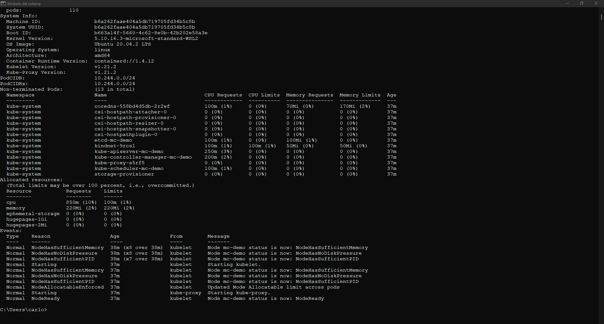

## Acceder a panel de Kubernetes

Dentro de Docker Desktop vamos a acceder a las configuraciones para poder acceder a los kubernetes. Nos dirigimos a la sección de Kubernetes y luego los habilitamos:

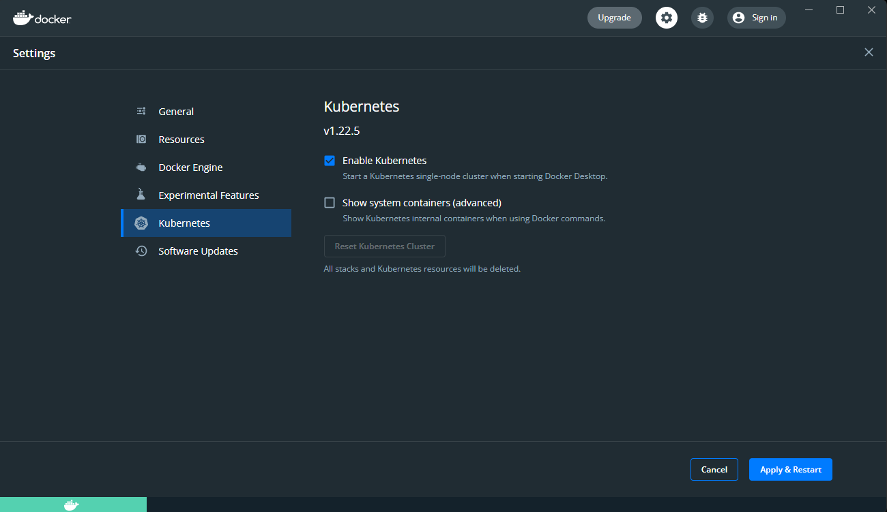

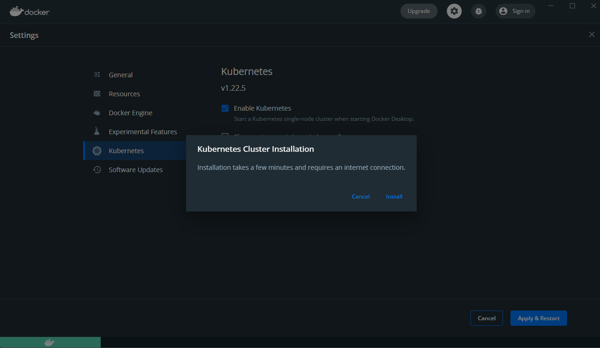

### Acceder a los contextos de Kubernetes

Podemos acceder a los contextos de los Kubernetes con el siguiente comando:

```txt
kubectl config get-contexts
```

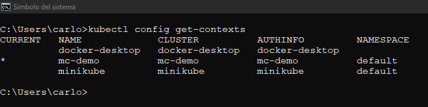

Podemos hacer los mismo si accedemos a la interfaz gráfica ofrecida por Docker Desktop:

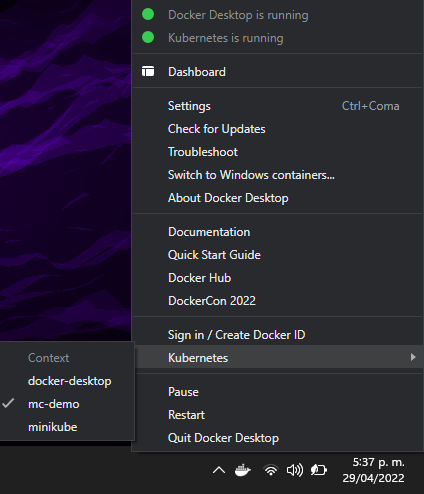

### Iniciar un servidor de Kubernetes

Levantamos un proxy con el siguiente comando:

```txt
kubectl proxy
```

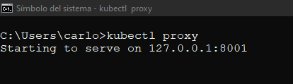

Verificamos los nodos activos con el siguiente comando:

```txt
kubectl get nodes
```

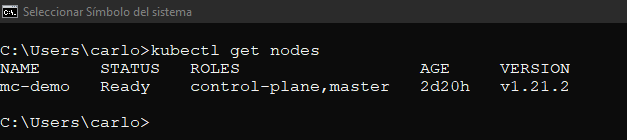

### Instalar kubernetes-dashboard

Usamos el siguiente comando:

```txt
kubectl apply -f https://raw.githubusercontent.com/kubernetes/dashboard/v2.5.0/aio/deploy/recommended.yaml
```

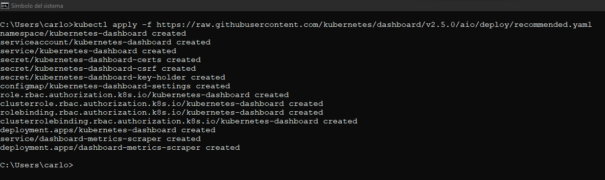

En el navegador accedemos a la siguiente dirección: `http://localhost:8001/api/v1/namespaces/kubernetes-dashboard/services/https:kubernetes-dashboard:/proxy/#/login`:

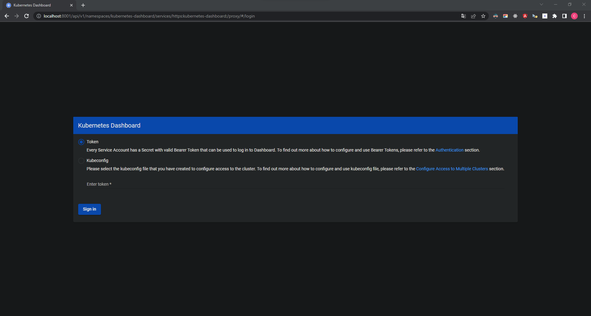

### Configurar la cuenta para Kubernetes

Debemos configurar la cuenta del servicio para poder obtener un token:

```txt
kubectl create serviceaccount geekflare -n default
```

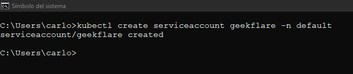

```txt
kubectl create clusterrolebinding geekflare-admin -n default --clusterrole=cluster-admin --serviceaccount=default:geekflare
```

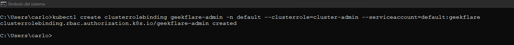

```txt
kubectl describe secret -n kube-system | grep deployment -A 12
```

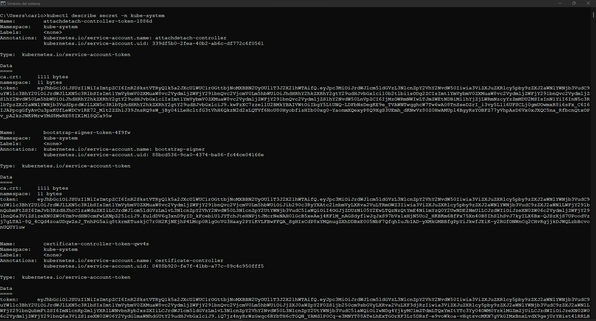

Usando el comando generado, volvemos al navegador y lo ponemos en el campo de texto:

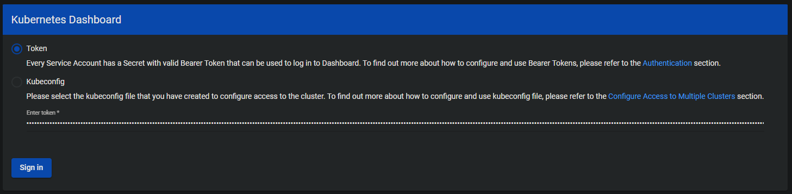

Cuando hemos ingresado, observaremos los siguiente:

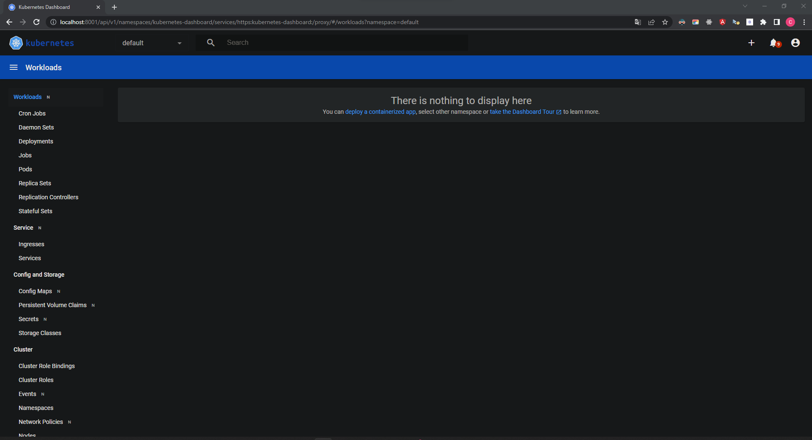
