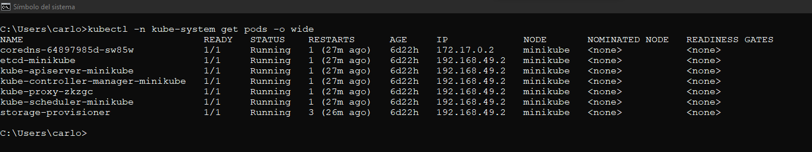
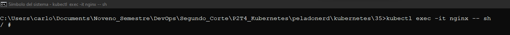
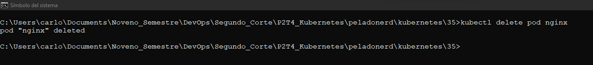

# Kubernetes

> Guía elaborada por: ***Carlos David Páez Ferreira***
>
> Guía Liderada por: ***Harvey Nicolás Echavarria Ortiz***
>
> Fecha: ***03 Mayo 2022***

## Configuraciones previas de Kubernetes

Necesitamos tener instalados Docker, Minikube, y Kubectl.

### Conocer la versión kubectl

```txt
kubectl version --client=true
```


### Iniciar Minikube

```txt
minikube start
```


### Minikube en Docker Desktop


### Kubernetes habilitado en Docker Desktop


### Listar nodos en el cluster de Kubernetes

```txt
kubectl get nodes
```


### Listar la lista de comandos de Kubectl

```txt
kubectl --help
```


### Obtener los contextos de la configuración

```txt
kubectl config get-contexts
```


## Recursos de Kubernetes

### Obtener los namespace

```txt
kubectl get ns
```


### Observar los pods dentro del contenedor kube-system

```txt
kubectl -n kube-system get pods
```


### Observar más información de los pods

```txt
kubectl -n kube-system get pods -o wide
```



### Comprobar que Kubernetes crear un pod de respaldo en caso de que alguno falle o sea eliminado

Eliminamos el pod `kube-proxy-zkzgc` que se encuentra en el listado del punto anterior:

```txt
kubectl -n kube-system delete pod kube-proxy-zkzgc
```


Volvemos a listar los pods y observamos un nuevo pod para el proxy:

```txt
kubectl -n kube-system get pods -o wide
```


## Repositorio para hacer pruebas

Clonamos el siguiente repositorio [GitHub - PeladoNerd](https://github.com/pablokbs/peladonerd "peladonerd")

```txt
git clone https://github.com/pablokbs/peladonerd
```


Nos ubicamos en el directorio `peladonerd/Kubernetes/35` y listamos todos los archivos que hay dentro de la carpeta:


Vamos a acceder al archivo `01-pod.yaml`, el cual es un archivo de manifiesto que consta de las siguientes secciones:

- `apiVersion`: Versión de la api del recurso de Kubernetes
- `kind`: Tipo de recurso
- `metadata`: Etiquetas o nombres. En este caso se necesita el nombre que será el nombre del pod.
- `containers`: Contenedores que correrán dentro del pod, en este caso nginx.

Todos los contenedores que corren dentro del pod tienen la misma ip.


### `01-pod.yaml` Aplicamos el manifiesto del Kubernetes

```txt
kubectl apply -f 01-pod.yaml
```


#### Listar los pods

```txt
kubectl get pods
```


#### Consola interactiva dentro del pod

```txt
kubectl exec -it nginx -- sh
```



Ejecutar un comando dentro de la terminal interactiva:

```txt
ps fax
```


#### Eliminar el pod de nginx

Eliminamos el pod de nginx, el cual no va a tener una copia de respaldo puesto que no se estableció una orden para ello.

```txt
kubectl delete pod nginx
```



```txt
kubectl get pods
```


### `02-pod.yaml`

Una de las opciones que se han agregado son las variables de entorno, que se componen de un nombre y un valor. Kubernetes tiene algo llamado downward api que son valores que se pueden heredar como la dirección ip del host de donde esta corriendo el pod. Así mismo se agrega la sección para limitar los recursos. Existen dos formas: request (son los recursos que le vamos a garantizar a este pod que siempre va a tener disponibles) y limits (Es el límite de recursos que el pod puede utilizar).


#### Aplicar el manifiesto

```txt
kubectl apply -f 02-pod.yaml
```


```txt
kubectl get pods
```


Obtenemos toda la información de pod con el siguiente comando:

```txt
kubectl get pod nginx -o yaml
```


#### Eliminar el pod

```txt
kubectl delete pod nginx
```


### `04-deployment.yaml`

Un deployment es un template para crear pods.


#### Aplicar el deployment

```txt
kubectl apply -f 04-deployment.yaml
```


```txt
kubectl get pods
```


#### Intentar eliminar uno de los despliegues

```txt
kubectl delete pod nginx-deployment-66c9c7669-bd7dk
```


Como el deployment tiene configurado crear un pod de respaldo cuando se elimine alguno, podemos observar que crear un nuevo pod en cuanto se remueve otro.

```txt
kubectl get pods
```


### `03-daemonset.yaml` Instalar un pod mediante DaemonSet

Tenemos el archivo `03-daemon.yaml`, dentro se configura el tipo como DaemonSet, el cual permite que al hacer deploy el pod este presente en todos los nodos. Este archivo ya no cuenta con réplicas pues dependerá de la cantidad de nodos que se tengan.


#### Aplicar el despliegue de DaemonSet

```txt
kubectl apply -f 03-daemonset.yaml
```


```txt
kubectl get pods
```


```txt
kubectl get pods -o wide
```


#### Comprobar el pod de respaldo

```txt
kubectl delete pod nginx-deployment-xlf8d
```


```txt
kubectl get pods
```


