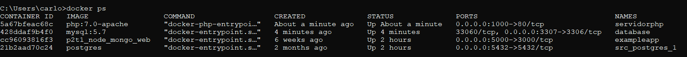
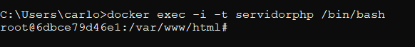
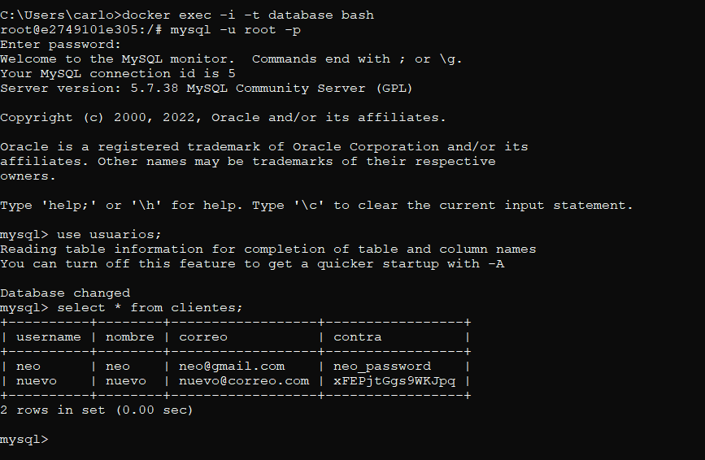
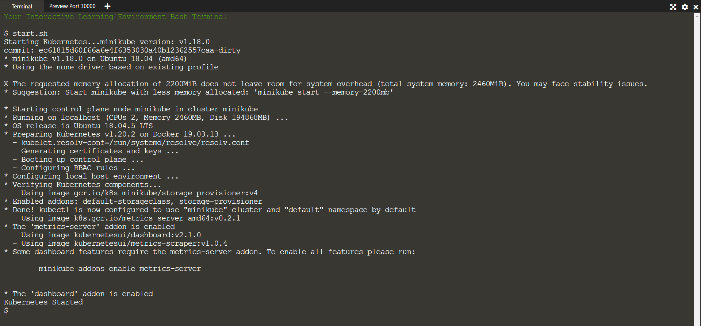
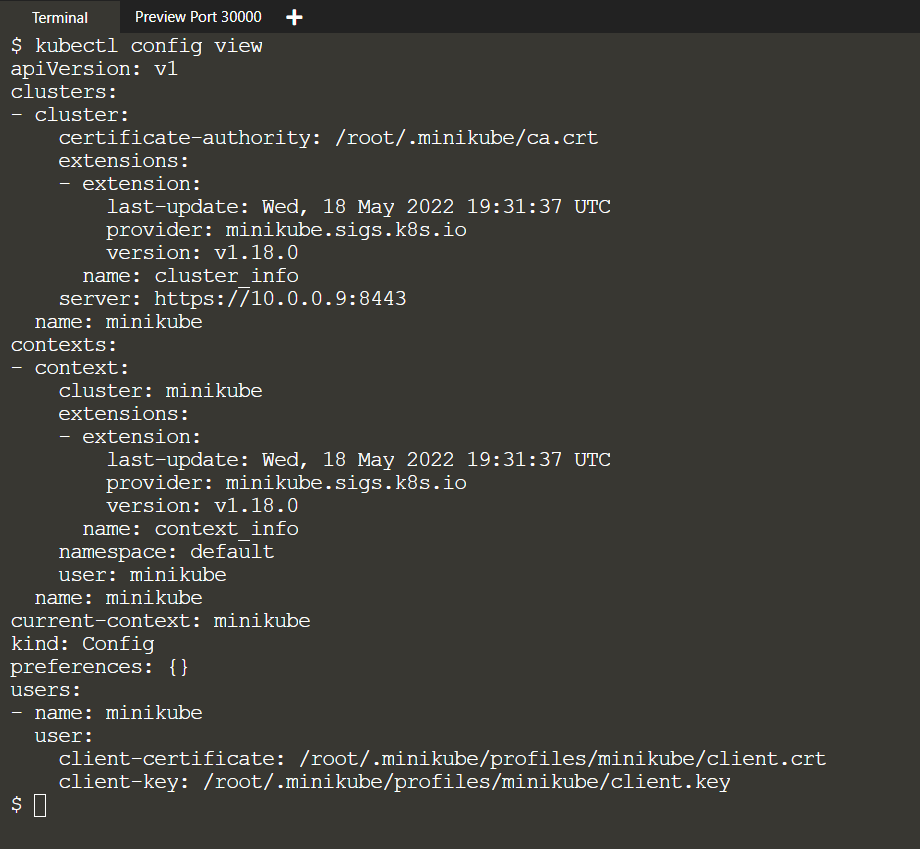
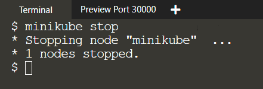
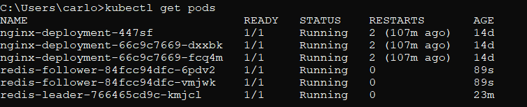
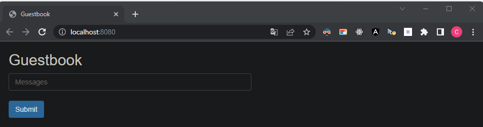

# Guía Final de Tercer Corte

> Guía elaborada por: ***Carlos David Páez Ferreira***
>
> Guía Liderada por: ***Harvey Nicolás Echavarria Ortiz***
>
> Fecha: ***17 Mayo 2022***

## Apartado 1: Docker

### Verificar la instalación de Docker

```txt
docker --version
```


### Instalar imágenes necesarias

Instalar las imágenes de MySQL 5.7 y PHP 7.0 junto Apache.

```txt
docker pull mysql:5.7 & docker pull php:7.0-apache
```


### Verificar las imágenes instaladas


```txt
docker images
```


### Correr imagen de MySQL

Vamos a ejecutar diferentes banderas al momento de correr la imagen de MySQL:

- `-p`: Indica el puerto por el cual escuchará la aplicación y el puerto del contenedor.
- `--name`: Indica el nombre del proceso o contenedor que se iniciará.
- `-v`: Indica que se creará un volumen, el cual permite almacenar datos de la DB en una carpeta con el fin de salvarlos en caso de que el contenedor se apague o se caiga. La primera rta hace referencia a la carpeta que se creará en nuestro equipo, la segunda hace referencia a la dirección del contenedor por defecto.
- `-e`: Indica la contraseña
- `-d`, para que MySQL corra en segundo plano.

```txt
docker run -p 3307:3306 --name database -v C:/Users/carlo/.../P3T1_Guia_Final:/var/lib/mysql -e MYSQL_ROOT_PASSWORD=password -d mysql:5.7
```


Verificamos que este corriendo nuestro contenedor:

```txt
docker ps
```


Dentro del directorio que hemos escogido, creamos una carpeta para almacenar una página web, y dentro de este directorio, añadimos un nuevo folder para la base de datos.


### Correr la imagen de PHP

Vamos a correr la imagen de PHP con las siguientes banderas:

- `-p`: Indicar el puerto
- `-name`: Indicar el nombre del proceso o contenedor
- `-v`: Indicar la creación de un volumen en el que almacenaremos los archivos de nuestro proyecto.
- `-d`: Correr en segundo plano
- `--link`: Comunicar entre el contenedor de PHP y la base de datos.

```txt
docker run -p 1000:80 -v C:/Users/carlo/.../P3T1_Guia_Final/Servicio_Web:/var/www/html --name servidorphp -d --link database php:7.0-apache
```


```txt
docker ps
```



Creamos un archivo llamado `index.php` dentro de la carpeta de `Servicio_Web`:


Dentro de nuestro nuevo archivo, escribimos lo siguiente:

```php
<?php
phpinfo();
?>
```

Luego, en el navegador ingresamos la siguiente ruta: `http://localhost:1000` y debemos obtener lo siguiente:


### Comprobar que el servidor MySQL funciona

Entrar a la consola interactiva del contenedor de mysql:

```txt
docker exec -i -t database bash
```


Ejecutar MySQL:

```txt
mysql -u root -p
```


Listar las bases de datos:

```sql
show databases;
```


Crear base de datos de usuarios:

```sql
create database usuarios;
```


Usar la base de datos recién creada:

```sql
use usuarios;
```


Crear tabla tabla de clientes:

```sql
create table clientes(username varchar(20) primary key not null, nombre varchar(30), correo varchar(50), contra varchar(20));
```


Insertar datos dentro de la tabla:

```sql
insert into clientes values ('neo', 'neo', 'neo@gmail.com', 'neo_password');
```


### Conectar PHP con la base de datos

Dentro del archivo `index.php` añadimos las siguientes líneas:

```php
<?php
$conn = mysqli_connect("database:3306", "root", "password", "usuarios");

if (!$conn) {
    die("Connection failed: " . mysqli_connect_error());
}

echo "Connected successfully";
?>
```

Cuando regresamos a la ruta dentro del navegador, vamos a observar el siguiente error:


Esto se debe a que la función `mysqli_connection()` no se encuentra definida, puesto que el servidor que tenemos instalado de php no tiene la extensión para conectarse a mysql. Para solucionar dicho error debemos seguir estos pasos:

- Abrir el contenedor de PHP por medio del siguiente comando:
  
  ```txt
  docker exec -i -t servidorphp /bin/bash
  ```

  

- Ir al directorio `/` y listar los archivos y directorios:
  
  

- Usamos el siguiente comando para instalar la extensión necesaria:
  
  ```txt
  docker-php-ext-install mysqli
  ```

  
  
  Debemos copiar la ruta que aparece en la sección de `Installing shared extensions` al momento de terminar la instalación de la extensión. (`/usr/local/lib/php/extensions/no-debug-non-zts-20151012/`)

  

- Nos ubicamos dentro de la ruta `/usr/local/etc/php/` y listamos los archivos que se encuentran dentro de dicho directorio
  
  

- Instalamos nano con los siguientes comandos:
  
  ```txt
  apt-get update
  ```

  ```txt
  apt-get install nano
  ```

  

- Abrimos el archivo `php.ini-development` mediante el siguiente comando:
  
  ```txt
  nano php.ini-development
  ```

  

  Luego, buscamos el apartado de rutas dinámicas y añadimos la ruta que teníamos copiada, y salimos del editor con `Ctrl + X`, `y` y `Enter`:

  

- Aplicamos el mismo procedimiento para el archivo de `php.init-production`:
  
  

- Reiniciamos el contenedor de PHP con el siguiente comando:
  
  ```txt
  docker restart servidorphp
  ```

  

  

- Recargamos el navegador, y esto será lo que debe aparecer:
  
  

### Página Web

Para efectos del taller vamos a añadir algunos archivos a nuestro directorio `Servicio_Web`:


Dentro del archivo `conexion.php` y `registro.php` hacemos los siguientes cambios en la variable de conexión a la base de datos:

```php
$con = mysqli_connect("database:3306","root","password","usuarios");
```

Si volvemos al navegador en la dirección `http://localhost:1000`, vamos a observar lo siguiente:


Si vamos al contenedor de la base de datos, podemos verificar que se ha registrado el usuario:

```txt
docker exec -i -t database bash
```

```txt
mysql -u root -p
```

```sql
use usuarios;
```

```sql
select * from clientes;
```



### Docker-Compose

Dentro del directorio `Servicio_Web` creamos el archivo `docker-compose.yml`, dentro del cual tendremos la siguiente información:

```yml
version: '3'

services:
    mysql:
        image: mysql:5.7
        container_name: docker-mysql
        environment:
            MYSQL_DATABASE: usuarios
            MYSQL_ROOT_USER: user_docker
            MYSQL_USER: user_docker
            MYSQL_PASSWORD: password
            MYSQL_ROOT_PASSWORD: password
        ports:
            - "3307:3306"
        restart: always

    web:
        image: php:7.0-apache
        container_name: docker-php
        ports:
            - "1000:80"
        volumes:
            - ./www:/var/www/html
        links:
            - mysql
```

Vamos a bajar nuestro contenedores:

```txt
docker stop database & docker stop servidorphp
```


Y ahora usamos el siguiente comando dentro del directorio `Servicio_Web`:

```txt
docker compose-up
```


Volvemos a intentar correr nuestra aplicación dentro del navegador, y recibiremos el siguiente mensaje debido a que no se configuro los directorio indicies (`index.php`, `index.html`).


## Apartado 2: Kubernetes

### Paso 1: Tutorial Interactivo Minikube

Debemos ingresa a la siguiente página para resolver el tutorial interactivo que se nos presenta: [Hello Minikube](https://kubernetes.io/docs/tutorials/hello-minikube/)


#### Crear un cluster de minikube

1. Abrir la terminal

   

2. Abrir el dashboard de Kubernetes en el navegador:

   ```txt
   minikube dashboard
   ```

   

3. Solo en el entorno de Katacoda: En la parte superior de la terminar, presionar el símbolo de `+`, y luego hacer click en `Select port to view on Host 1`:

   

4. Solo en el entorno de Katacoda: Escribe `30000` y haz click en `Display Port`:

   

   

#### Abrir Dashboard con URL

Si tu no quieres abrir un navegador web, corre el comando de dashboard con la bandera adicional `--flag` para emitir una URL:

```txt
minikube dashboard --flag
```


#### Crear un despliegue

1. Use el comando `kubectl create` para crear un despliegue que maneje un Pod. El Pod corre un Container basado en imagen provista de Docker:

   ```txt
   kubectl create deployment hello-node --image=k8s.gcr.io/echoserver:1.4
   ```

   

2. Visualiza el despliegue

   ```txt
   kubectl get deployments
   ```

   

3. Visualiza el pod:

   ```txt
   kubectl get pods
   ```

   

4. Visualiza los eventos del cluster

   ```txt
   kubectl get events
   ```

   

5. Visualiza la configuración de `kubectl`

   ```txt
   kubectl config view
   ```

   

#### Crear un Servicio

1. Exponer el Pod al internet público usado el comando `kubectl expose`:

   ```txt
   kubectl expose deployment hello-node --type=LoadBalancer --port=8080
   ```

   La bandera `--type=LoadBalancer` indica que tu quieres exponer tu servicio fuera del cluster.

   El código de la aplicación dentro de la imagen `k8s.gcr.io/echoserver` solo escucha el puerto TCP 8080. Si tu quieres usar `kubectl expose` para exponer en un puerto diferente, los clientes no podrán conectarse al otro puerto.

   

2. Visualizar el servicio creado

   ```txt
   kubectl get services
   ```

   

   En los proveedores de cloud que soportan balanceo de carga, una IP externa debe ser provista para acceder al servicio. En minikube, el tipo `LoadBalancer` hace accesible el servicio mediante el comando `minikube service`

3. Correr el siguiente comando:

   ```txt
   minikube service hello-node
   ```

   

4. Solo en el entorno Katacoda: Haz click en el símbolo de `+`, y selecciona `Select port to view on Host 1`.

   

5. Solo en el entorno Katacoda: Tenga en cuenta el puerto de 5 dígitos que se muestra en oposición al puerto `8080` en la salida del punto 3. Este número de puerto es generado aleatoriamente y puede ser diferente al tuyo. Ingresa tu número en la caja de texto del puerto, y haz click en `Display Port`.

   Esto abrirá una ventana del navegador que servirá tu app y mostrará la respuesta de la aplicación.

   

   

#### Activar Complementos

1. Listar los complementos actualmente soportados

   ```txt
   minikube addons list
   ```

   

2. Activar un complemento, por ejemplo `metrics-server`:

   ```txt
   minikube addons enable metrics-server
   ```

   

3. Visualizar el Pod y el Servicio que creaste:

   ```txt
   kubectl get pod,svc -n kube-system
   ```

   

4. Desactivar `metrics-server`

   ```txt
   minikube addons disable metrics-server
   ```

   

#### Limpieza

1. Vamos a limpiar los recursos que creaste en el cluster

   ```txt
   kubectl delete service hello-node & kubectl delete deployment hello-node
   ```

   

2. Opcionalmente, detén la máquina virtual de Minikube

   ```txt
   minikube stop
   ```

   

3. Opcionalmente, elimina la maquina virtual de Minikube

   ```txt
   minikube delete
   ```

   

### Paso 2: Kubernetes en Windows

#### Conocer la versión de Kubectl

```txt
kubectl version --client=true
```


#### Iniciar minikube

```txt
minikube start --driver=docker
```


#### Estatus de minikube

```txt
minikube status
```


#### Habilitar Kubernetes en Docker


#### Observar los nodos de nuestro cluster de Kubernetes

```txt
kubectl get nodes
```


### Paso 3: Tutorial Interactivo

Debemos ingresar a la siguiente URL para realizar el tutorial indicado: [Implementación de la aplicación PHP Guestbook con Redis](https://kubernetes.io/docs/tutorials/stateless-application/guestbook/)

#### Creación del despliegue de Redis

El archivo de manifiesto, especifica un controlador de Despliegue que corre una replica única replica del Pod Redis.

1. Lanzar una terminar de Windows en donde descargaste los archivos manifiestos.
2. Aplicar la implementación de Redis desde el archivo `redis-leader-deployment.yaml`

   ```txt
   kubectl apply -f https://k8s.io/examples/application/guestbook/redis-leader-deployment.yaml
   ```

   

3. Consultar la lista de Pods, para verificar que el Pod de Redis esté corriendo:

   ```txt
   kubectl get pods
   ```

   

4. Correr el siguiente comando para ver los logs del Pod de Redis líder

   ```txt
   kubectl logs -f deployment/redis-leader
   ```

   

#### Creación del servicio líder de Redis

La aplicación de guestbook necesita conectarse con Redis para escribir su data. Tu necesitas aplicar un Servicio al proxy de trafico del Pod de Redis. Un servicio define la política de acceso a los Pods.

1. Aplicar el servicio de Redis desde el archivo `redis-leader-server.yaml`

   ```txt
   kubectl apply -f https://k8s.io/examples/application/guestbook/redis-leader-service.yaml
   ```

   

2. Listar los servicios, para verificar que el servicio de Redis esté corriendo:

   ```txt
   kubectl get service
   ```

   

#### Configurar los seguidores de Redis

Aunque el Redis líder es un único Pod, puedes hacer que esté altamente disponible y satisfacer las demandas de tráfico agregando algunos seguidores o réplicas de Redis.

1. Aplicar el despliegue de Redis desde el archivo `redis-follower-deployment.yaml`:

   ```txt
   kubectl apply -f https://k8s.io/examples/application/guestbook/redis-follower-deployment.yaml
   ```

   

2. Verificar que las 2 replicas de Redis estén corriendo:

   ```txt
   kubectl get pods
   ```

   

#### Creación del Servicio de seguidores de Redis

La aplicación guestbook necesita comunicarse con los seguidores de Redis para leer la data. Para hacer que los seguidores de Redis sean detectables, debemos configurar otro servicio.

1. Aplicamos el servicio de Redis desde el archivo `redis-follower-service.yaml`.

   ```txt
   kubectl apply -f https://k8s.io/examples/application/guestbook/redis-follower-service.yaml
   ```

   

2. Consultamos que los servicios de Redis estén corriendo:

   ```txt
   kubectl get service
   ```

   

#### Configurar y exponer el Frontend de Guestbook: Crear un despliegue del Frontend

1. Aplicamos el despliegue del frontend desde `frontend-deployment.yaml`

   ```txt
   kubectl apply -f https://k8s.io/examples/application/guestbook/frontend-deployment.yaml
   ```

   

2. Consultar los pods para verificar que 3 replicas del frontend estén corriendo:

   ```txt
   kubectl get pods -l app=guestbook -l tier=frontend
   ```

   

#### Creando el servicio del Frontend

1. Aplicamos el servicio del frontend desde el archivo `frontend-service.yaml`:

   ```txt
   kubectl apply -f https://k8s.io/examples/application/guestbook/frontend-service.yaml
   ```

   

2. Consultar la lista de servicios para verificar que esté corriendo el servicio del Frontend.

   ```txt
   kubectl get services
   ```

   

#### Observar el servicio del frontend via `kubectl port-forward`

1. Correr el siguiente comando por el puerto delantero `8080` en tu maquina local, al puerto `80` en el servicio.

   ```txt
   kubectl port-forward svc/frontend 8080:80
   ```

   

2. Abrir la siguiente dirección en el navegador: `http://localhost:8080`

   

#### Observar el servicio del frontend via `LoadBalancer`

1. Ejecuta el siguiente comando para obtener la dirección IP del servicio del frontend.

   ```txt
   kubectl get service frontend
   ```

   

2. Copiar la dirección IP externa, y carga una página en el navegador para observar el frontend

#### Escalar el Frontend Web

1. Ejecutar el siguiente comando para aumentar el número de pods del frontend:

   ```txt
   kubectl scale deployment frontend --replicas=5
   ```

   

2. Consultar los pods para verificar el número de pods del frontend corriendo

   ```txt
   kubectl get pods
   ```

   

3. Correr el siguiente comando para disminuir el número de de pods del frontend corriendo

   ```txt
   kubectl scale deployment frontend --replicas=2
   ```

   

4. Consultar los pods para verificar el número de pods del frontend corriendo

   ```txt
   kubectl get pods
   ```

   

#### Limpiando

Eliminar los despliegues y servicios también elimina cualquier Pod corriendo. Use labels para eliminar múltiples recursos con un comando.

```txt
kubectl delete deployment -l app=redis
```

```txt
kubectl delete service -l app=redis
```

```txt
kubectl delete deployment frontend
```

```txt
kubectl delete service frontend
```


Consulta la lista de pods que están corriendo:

```txt
kubectl get pods
```


